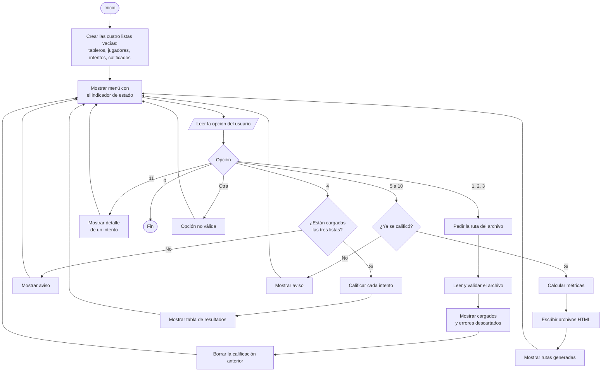
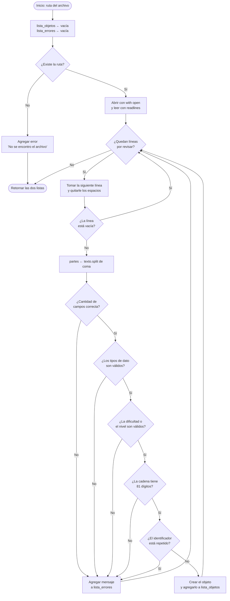
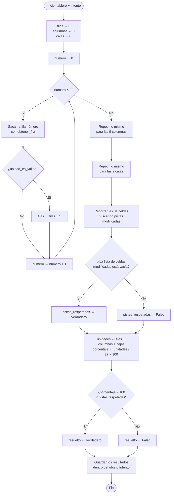
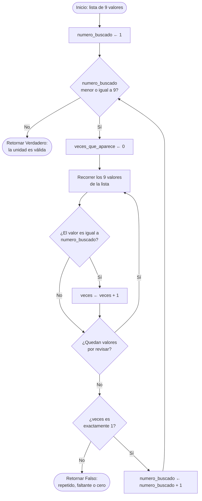
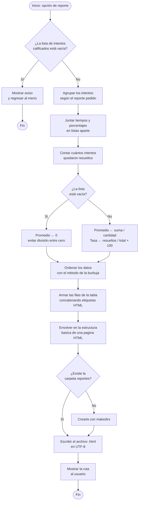
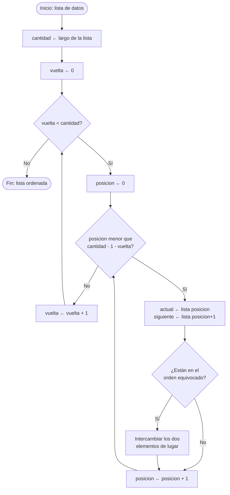

# Diagrama de Flujo del Sistema

**Torneo de Sudoku — Numerix Academy**
Práctica 1 · Lenguajes Formales y de Programación · 2S2026

> Los diagramas están en formato Mermaid, que GitHub renderiza automáticamente
> al abrir este archivo. Para exportarlos como imagen puede usar
> [mermaid.live](https://mermaid.live) pegando el código de cada bloque.

---

## 1. Flujo general del programa

---

## 2. Lectura y procesamiento de un archivo `.lfp`

---

## 3. Validación matricial de un intento

---

## 4. Verificación de una unidad (fila, columna o caja)

---

## 5. Cálculo de métricas y generación de un reporte

---

## 6. Método de ordenamiento burbuja

---

## 7. Simbología utilizada

| Símbolo | Significado |
|---|---|
| Óvalo | Inicio o fin del proceso |
| Rectángulo | Proceso o acción |
| Rombo | Decisión (bifurcación condicional) |
| Paralelogramo | Entrada o salida de datos |
| Flecha | Sentido del flujo |
