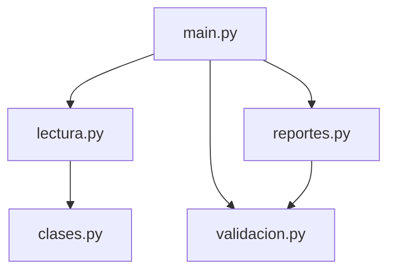
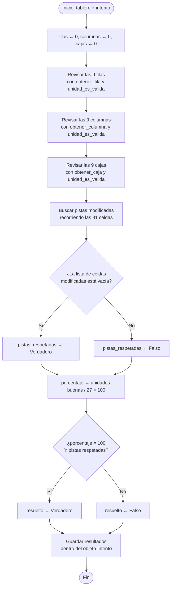

# Manual Técnico

**Torneo de Sudoku — Numerix Academy**
Práctica 1 · Lenguajes Formales y de Programación · 2S2026

---

## 1. Descripción general

El sistema es un programa de consola desarrollado en **Python 3** que funciona
como motor de calificación y análisis de un torneo de Sudoku. Lee tres archivos
de texto delimitados por comas (`.lfp`), reconstruye cada tablero como una matriz
de 9×9, valida cada intento contra las reglas del Sudoku, calcula métricas de
desempeño y produce reportes analíticos en HTML.

No utiliza librerías externas. La lectura de archivos se hace con las funciones
nativas `open()`, `with` y `readlines()`, y el análisis de cada registro con el
método `split(',')` de las cadenas.

---

## 2. Arquitectura del sistema

El proyecto está organizado en cinco archivos `.py` ubicados en la carpeta
principal, sin subcarpetas de código. Cada archivo agrupa las funciones de una
misma responsabilidad.

```
Practica1/
├── main.py           Menú de consola y control del flujo
├── clases.py         Clases Tablero, Jugador e Intento
├── lectura.py        Lectura de archivos .lfp y validación de formato
├── validacion.py     Validación matricial del Sudoku
├── reportes.py       Cálculo de estadísticas y generación de HTML
├── entrada/          Archivos .lfp de entrada
└── reportes/         Salida .html generada
```

### Diagrama de dependencias



Las dependencias apuntan en una sola dirección. `clases.py` no importa nada del
proyecto, `validacion.py` trabaja solo con objetos ya construidos, y `main.py`
es el único que conoce a todos. Esto evita importaciones circulares y permite
modificar los reportes sin tocar la validación.

### Responsabilidad de cada archivo

| Archivo | Contiene |
|---|---|
| `clases.py` | Los tres moldes de objetos y la función que convierte una cadena de 81 dígitos en matriz 9×9 |
| `lectura.py` | Apertura de archivos, separación de campos, validación de formato y creación de objetos |
| `validacion.py` | Extracción de filas, columnas y cajas; verificación de la regla; calificación de intentos; búsqueda en listas |
| `reportes.py` | Promedios, tasas de éxito, ordenamientos y construcción de los archivos HTML |
| `main.py` | Menú, estado del programa y llamadas a las funciones anteriores |

---

## 3. Clases implementadas (POO)

Las tres clases están en `clases.py`. Todas usan métodos de instancia
convencionales que reciben `self`.

### 3.1 Clase `Tablero`

Representa un tablero publicado en el torneo.

| Atributo | Tipo | Descripción |
|---|---|---|
| `id_sudoku` | `int` | Identificador único |
| `dificultad` | `str` | `Facil`, `Media`, `Dificil` o `Experto` |
| `cadena` | `str` | Cadena original de 81 dígitos |
| `matriz` | `list` de `list` | Matriz 9×9 reconstruida |

| Método | Descripción |
|---|---|
| `__init__(id_sudoku, dificultad, cadena)` | Guarda los datos y construye la matriz |
| `contar_pistas()` | Recorre las 81 celdas y cuenta las distintas de `0` |
| `dibujar()` | Devuelve el tablero como texto, con separadores de cajas |

### 3.2 Clase `Jugador`

| Atributo | Tipo | Descripción |
|---|---|---|
| `carnet` | `int` | Identificador único |
| `nombre`, `apellido` | `str` | Datos personales |
| `nivel` | `str` | `Principiante`, `Intermedio` o `Experto` |

| Método | Descripción |
|---|---|
| `obtener_nombre_completo()` | Concatena nombre y apellido con un espacio |

### 3.3 Clase `Intento`

Combina los datos leídos del archivo con los resultados de la calificación,
que se llenan después al ejecutar la opción 4.

| Atributo de entrada | Descripción |
|---|---|
| `carnet`, `id_sudoku` | Referencias hacia un Jugador y un Tablero |
| `solucion` | Cadena de 81 dígitos |
| `matriz` | Matriz 9×9 de la propuesta |
| `tiempo_segundos`, `fecha` | Datos del registro |

| Atributo de resultado | Valor inicial | Descripción |
|---|---|---|
| `filas_validas` | `0` | Filas correctas (0–9) |
| `columnas_validas` | `0` | Columnas correctas (0–9) |
| `cajas_validas` | `0` | Cajas 3×3 correctas (0–9) |
| `porcentaje_validez` | `0.0` | Porcentaje sobre 27 unidades |
| `pistas_respetadas` | `True` | Si no modificó celdas fijas |
| `celdas_modificadas` | `[]` | Lista de pares `[fila, columna]` |
| `resuelto_correctamente` | `False` | Veredicto final |
| `observacion` | `"Sin calificar"` | Explicación textual del resultado |

| Método | Descripción |
|---|---|
| `contar_unidades_validas()` | Suma filas, columnas y cajas correctas |

---

## 4. Lógica de validación matricial

### 4.1 Reconstrucción de la matriz

La función `convertir_cadena_a_matriz(cadena)` de `clases.py` transforma los 81
caracteres en una lista de listas. La correspondencia entre la posición lineal y
las coordenadas es:

```
posicion = numero_fila * 9 + numero_columna
```

**Pseudocódigo:**

```
FUNCION convertir_cadena_a_matriz(cadena):
    matriz ← lista vacía
    PARA numero_fila DESDE 0 HASTA 8 HACER
        fila ← lista vacía
        PARA numero_columna DESDE 0 HASTA 8 HACER
            posicion ← numero_fila * 9 + numero_columna
            caracter ← cadena[posicion]
            fila.agregar( entero(caracter) )
        FIN PARA
        matriz.agregar(fila)
    FIN PARA
    RETORNAR matriz
```

La validación de longitud y de que todos los caracteres sean dígitos se hace
antes, en `lectura.py`, mediante la función `cadena_de_81_digitos()`. De esa
manera el constructor solo recibe cadenas ya verificadas.

### 4.2 Extracción de las tres unidades

Una **unidad** es una fila, una columna o una caja de 3×3. Hay 27 en total.

```
FUNCION obtener_fila(matriz, numero_fila):
    fila ← lista vacía
    PARA numero_columna DESDE 0 HASTA 8 HACER
        fila.agregar( matriz[numero_fila][numero_columna] )
    RETORNAR fila

FUNCION obtener_columna(matriz, numero_columna):
    columna ← lista vacía
    PARA numero_fila DESDE 0 HASTA 8 HACER
        columna.agregar( matriz[numero_fila][numero_columna] )
    RETORNAR columna

FUNCION obtener_caja(matriz, numero_caja):
    fila_inicial    ← (numero_caja DIV 3) * 3
    columna_inicial ← (numero_caja MOD 3) * 3
    caja ← lista vacía
    PARA i DESDE fila_inicial HASTA fila_inicial + 2 HACER
        PARA j DESDE columna_inicial HASTA columna_inicial + 2 HACER
            caja.agregar( matriz[i][j] )
    RETORNAR caja
```

Las cajas se numeran de 0 a 8, de izquierda a derecha y de arriba hacia abajo:

```
+-------+-------+-------+
| caja0 | caja1 | caja2 |
+-------+-------+-------+
| caja3 | caja4 | caja5 |
+-------+-------+-------+
| caja6 | caja7 | caja8 |
+-------+-------+-------+
```

El cálculo de la esquina superior izquierda usa división entera y residuo. Para
la caja 5:

```
fila_inicial    = (5 // 3) * 3 = 1 * 3 = 3
columna_inicial = (5 %  3) * 3 = 2 * 3 = 6
```

### 4.3 Verificación de una unidad

Una unidad es válida si contiene los dígitos del 1 al 9 y ninguno se repite. La
implementación cuenta las apariciones de cada dígito:

```
FUNCION unidad_es_valida(valores):
    PARA numero_buscado DESDE 1 HASTA 9 HACER
        veces ← 0
        PARA CADA valor EN valores HACER
            SI valor = numero_buscado ENTONCES
                veces ← veces + 1
        FIN PARA
        SI veces ≠ 1 ENTONCES
            RETORNAR Falso
    FIN PARA
    RETORNAR Verdadero
```

Esta única revisión cubre tres situaciones distintas:

| Situación | Cómo se detecta |
|---|---|
| Un número repetido | Ese número aparece 2 o más veces |
| Un número faltante | Ese número aparece 0 veces |
| Una celda vacía (`0`) | El `0` desplaza a algún dígito del 1 al 9, que entonces aparece 0 veces |

### 4.4 Verificación de las pistas originales

Se recorren las 81 celdas comparando el tablero publicado contra la propuesta.
Si el tablero traía un valor fijo y la propuesta tiene otro, esa celda se
registra como modificada.

```
FUNCION buscar_pistas_modificadas(tablero, intento):
    celdas_modificadas ← lista vacía
    PARA numero_fila DESDE 0 HASTA 8 HACER
        PARA numero_columna DESDE 0 HASTA 8 HACER
            valor_original    ← tablero.matriz[numero_fila][numero_columna]
            valor_del_jugador ← intento.matriz[numero_fila][numero_columna]
            SI valor_original ≠ 0 ENTONCES
                SI valor_del_jugador ≠ valor_original ENTONCES
                    celdas_modificadas.agregar( [numero_fila, numero_columna] )
    RETORNAR celdas_modificadas
```

### 4.5 Cálculo del porcentaje de validez

```
porcentaje_validez = (filas válidas + columnas válidas + cajas válidas) / 27 × 100
```

Un intento se marca como **resuelto correctamente** solo si cumple **ambas**
condiciones, que son independientes entre sí:

1. `porcentaje_validez == 100`
2. `pistas_respetadas == True`

Esta distinción importa: un jugador puede entregar un tablero perfectamente
válido según las reglas del Sudoku pero que no corresponde al que se le asignó,
porque modificó las pistas. En ese caso el porcentaje puede ser alto o incluso
100, pero el intento no cuenta como resuelto.

### 4.6 Diagrama de flujo de la calificación



---

## 5. Lectura y procesamiento de archivos

### 5.1 Estrategia

Cada función de carga (`cargar_sudokus`, `cargar_jugadores`, `cargar_intentos`)
devuelve **dos listas**: los objetos que se pudieron crear y los mensajes de
error de las líneas defectuosas.

```
FUNCION cargar_X(ruta):
    lista_objetos ← vacía
    lista_errores ← vacía

    lineas ← leer_lineas_del_archivo(ruta)
    SI lineas = Nulo ENTONCES
        lista_errores.agregar("No se encontro el archivo")
        RETORNAR lista_objetos, lista_errores

    numero_linea ← 0
    PARA CADA linea EN lineas HACER
        numero_linea ← numero_linea + 1
        texto ← linea.strip()
        SI texto está vacío ENTONCES continuar

        partes ← texto.split(",")

        SI cantidad de campos incorrecta ENTONCES
            lista_errores.agregar(mensaje);  continuar
        SI algún tipo de dato inválido ENTONCES
            lista_errores.agregar(mensaje);  continuar
        SI dominio cerrado no cumple ENTONCES
            lista_errores.agregar(mensaje);  continuar
        SI identificador duplicado ENTONCES
            lista_errores.agregar(mensaje);  continuar

        objeto ← crear el objeto correspondiente
        lista_objetos.agregar(objeto)
    FIN PARA

    RETORNAR lista_objetos, lista_errores
```

La instrucción `continue` es la clave: al detectar un problema se salta a la
siguiente línea en lugar de detener la lectura. Así una línea corrupta no
inutiliza todo el archivo.

Los errores se guardan como cadenas de texto, no como excepciones. La razón es
que ninguno de estos casos es una falla del programa: son datos de entrada
imperfectos, un resultado esperado que la función debe reportar.

### 5.2 Funciones de validación

Todas están en `lectura.py` y devuelven `True` o `False`:

| Función | Verifica |
|---|---|
| `es_numero_entero(texto)` | Que el texto no esté vacío y contenga solo dígitos (`isdigit()`) |
| `dificultad_es_valida(dificultad)` | Que sea `Facil`, `Media`, `Dificil` o `Experto` |
| `nivel_es_valido(nivel)` | Que sea `Principiante`, `Intermedio` o `Experto` |
| `cadena_de_81_digitos(cadena)` | Longitud exacta de 81 y que cada carácter sea dígito |
| `fecha_es_valida(fecha)` | Formato `DD-MM-AAAA`, con día 1–31 y mes 1–12 |
| `existe_tablero_con_id(lista, id)` | Que el identificador no esté repetido |
| `existe_jugador_con_carnet(lista, carnet)` | Que el carnet no esté repetido |

### 5.3 Validaciones por archivo

| Archivo | Validaciones aplicadas |
|---|---|
| `sudokus.lfp` | 3 campos; `id_sudoku` entero; dificultad dentro del dominio; tablero de 81 dígitos; id no duplicado |
| `jugadores.lfp` | 4 campos; `carnet` entero; nombre y apellido no vacíos; nivel dentro del dominio; carnet no duplicado |
| `intentos.lfp` | 5 campos; `carnet` e `id_sudoku` enteros; solución de 81 dígitos; `tiempo_segundos` entero; fecha `DD-MM-AAAA` |

### 5.4 Integridad referencial

Además del formato, al calificar (opción 4) se verifica que cada intento apunte
a un carnet y a un `id_sudoku` que realmente existan. Los que no cumplen se
descartan y se listan por separado.

Esta validación es distinta de las anteriores porque **cruza información entre
archivos**, y solo puede hacerse cuando las tres listas ya están en memoria. Al
leer `intentos.lfp` todavía no se sabe si los otros archivos fueron cargados.

### 5.5 Estructuras de datos utilizadas

| Colección | Estructura | Acceso |
|---|---|---|
| Tableros | Lista de objetos `Tablero` | Función `buscar_tablero(lista, id_sudoku)` |
| Jugadores | Lista de objetos `Jugador` | Función `buscar_jugador(lista, carnet)` |
| Intentos | Lista de objetos `Intento` | Recorrido completo con `for` |
| Estadísticas | Listas de diccionarios | Acceso por clave: `datos["tasa_exito"]` |

Las funciones de búsqueda recorren la lista comparando el identificador y
devuelven el objeto encontrado, o `None` si no existe.

---

## 6. Cálculo de métricas

Implementado en `reportes.py`.

| Métrica | Fórmula | Función |
|---|---|---|
| Promedio | `suma / cantidad` | `calcular_promedio(lista)` |
| Tasa de éxito | `resueltos / total × 100` | `calcular_tasa_de_exito(resueltos, total)` |

Ambas funciones devuelven `0` cuando la colección está vacía, para evitar la
división por cero que detendría el programa con un error.

**Dificultad real observada.** Se infiere del comportamiento de los jugadores
para contrastarla con la dificultad declarada por la plataforma:

| Tasa de éxito | Dificultad observada |
|---|---|
| ≥ 80% | Facil |
| ≥ 60% | Media |
| ≥ 40% | Dificil |
| < 40% | Experto |

### Funciones de formato

| Función | Propósito |
|---|---|
| `formato_porcentaje(numero)` | Devuelve el número con dos decimales y `%`. Necesaria porque `round(50.0, 2)` produce `50.0`, con un solo decimal |
| `convertir_a_minutos(segundos)` | Convierte segundos a `mm:ss` usando división entera y residuo |
| `clasificar_dificultad_real(tasa)` | Traduce la tasa de éxito a una etiqueta de dificultad observada |

---

## 7. Ordenamiento de datos

Los reportes requieren mostrar la información ordenada. Se implementó el
**método de la burbuja**, escrito de forma explícita en tres funciones:

| Función | Ordena | Criterio |
|---|---|---|
| `ordenar_por_validez_de_mayor_a_menor(lista)` | Diccionarios de jugadores | Validez promedio, descendente |
| `ordenar_intentos_por_tiempo(lista)` | Objetos `Intento` | Tiempo en segundos, ascendente |
| `ordenar_por_tasa_de_menor_a_mayor(lista)` | Diccionarios de tableros | Tasa de éxito, ascendente |

**Funcionamiento del método de la burbuja:**

```
PARA vuelta DESDE 0 HASTA cantidad - 1 HACER
    PARA posicion DESDE 0 HASTA cantidad - 2 - vuelta HACER
        actual    ← lista[posicion]
        siguiente ← lista[posicion + 1]
        SI están en el orden equivocado ENTONCES
            lista[posicion]     ← siguiente
            lista[posicion + 1] ← actual
```

Se compara cada elemento con el que le sigue y se intercambian si están al
revés. Después de la primera vuelta, el elemento mayor queda al final; por eso
el ciclo interno recorre uno menos en cada vuelta (`cantidad - 1 - vuelta`).

Las funciones modifican la lista recibida directamente, sin devolver una nueva,
porque en Python las listas se pasan por referencia.

---

## 8. Generación de reportes HTML

Un archivo HTML es texto plano. Cada función de reporte construye una cadena
larga concatenando etiquetas, y la guarda con extensión `.html`.

| Función | Propósito |
|---|---|
| `armar_documento_html(titulo, subtitulo, contenido)` | Envuelve el contenido en la estructura básica de una página HTML |
| `armar_encabezado_tabla(lista_de_titulos)` | Construye la primera fila de la tabla con etiquetas `<th>` |
| `guardar_archivo_html(carpeta, nombre, contenido)` | Crea la carpeta si no existe y escribe el archivo en UTF-8 |

| Archivo generado | Contenido |
|---|---|
| `reporte_resumen_sudokus.html` | Métricas por tablero |
| `reporte_rendimiento_jugadores.html` | Métricas por jugador |
| `reporte_top_tiempos.html` | Top 10 mejores tiempos |
| `reporte_sudokus_dificiles.html` | Tableros por menor tasa de éxito |
| `reporte_analisis_nivel.html` | Desempeño agrupado por nivel |

Los reportes usan únicamente etiquetas básicas de HTML, sin hojas de estilo:

| Etiqueta | Función |
|---|---|
| `<h1>` | Título del reporte |
| `<p>` | Párrafos del subtítulo y el pie |
| `<table border='1'>` | Tabla con las líneas de la cuadrícula dibujadas por el navegador |
| `<tr>` | Una fila de la tabla |
| `<th>` | Celda de encabezado; el navegador la muestra en negrita |
| `<td>` | Celda de datos |
| `<hr>` | Línea horizontal antes del pie de página |

El atributo `border='1'` de la etiqueta `<table>` es lo que dibuja la
cuadrícula. Al no depender de CSS ni de ningún recurso externo, los archivos se
pueden abrir o enviar tal cual, y se ven igual en cualquier navegador.

---

## 9. Manejo de errores

El programa no define clases de excepción propias. Los problemas se manejan de
tres maneras según su naturaleza:

| Situación | Tratamiento | Dónde |
|---|---|---|
| Archivo inexistente | `os.path.exists()` devuelve `False`; la función retorna `None` y el mensaje se agrega a la lista de errores | `leer_lineas_del_archivo()` |
| Línea con formato inválido | Se agrega un mensaje a `lista_errores` y se usa `continue` para saltar a la siguiente | Las tres funciones de carga |
| Carnet o sudoku inexistente | El intento se descarta al calificar y se reporta aparte | `opcion_calificar()` en `main.py` |
| Archivos no cargados antes de calificar | Se revisa el largo de las listas y se muestra un aviso | `opcion_calificar()` |
| Intentos no calificados antes de un reporte | Se revisa el largo de `intentos_calificados` y se muestra un aviso | `opcion_generar_reporte()` |
| Opción de menú no numérica | Se compara contra las opciones válidas con `if / elif` | `main()` |
| División entre cero en promedios | Se verifica el largo de la lista antes de dividir | `calcular_promedio()` |

---

## 10. Estructuras de control utilizadas

| Estructura | Ejemplo de uso en el proyecto |
|---|---|
| `while True` | Ciclo principal del menú, hasta seleccionar la opción 0 |
| `while` con condición | Relleno de espacios y ceros para alinear texto |
| `for` con `range` | Recorrido de índices 0 a 8 para filas, columnas y cajas |
| `for` sobre listas | Recorrido de intentos, jugadores y líneas del archivo |
| `for` anidado | Construcción de la matriz, revisión de pistas, método de la burbuja |
| `if / elif / else` | Despacho de opciones del menú y clasificación de dificultad |
| `continue` | Saltar líneas vacías o con formato inválido |
| `break` | Cortar el Top 10 al llegar al décimo elemento |

---

## 11. Requerimientos técnicos

| Requerimiento | Versión / detalle |
|---|---|
| Lenguaje | Python 3.8 o superior |
| Librerías externas | Ninguna |
| Módulos estándar usados | `os` |
| Codificación de archivos | UTF-8 |
| Estándar de estilo | PEP 8 (verificado con `pycodestyle`, límite de 100 columnas) |
| Entorno de prueba | Python 3.12 · Windows 10/11 y Linux |
| Total de líneas de código | Aproximadamente 2,070 distribuidas en 5 archivos |

---

## 12. Cumplimiento de PEP 8

El código fue verificado con la herramienta `pycodestyle` sin advertencias.
Convenciones aplicadas:

- `snake_case` para funciones, métodos y variables
- `PascalCase` para nombres de clases (`Tablero`, `Jugador`, `Intento`)
- `MAYUSCULAS` para constantes de módulo (`RUTA_BASE`, `CARPETA_ENTRADA`,
  `CARPETA_REPORTES`)
- Docstrings en todos los módulos, clases y funciones
- Indentación de 4 espacios y dos líneas en blanco entre definiciones de nivel
  superior
- Comparaciones con `is True`, `is False` e `is None` en lugar de `==`, según
  recomienda el estándar para valores singleton
- Nombres de variables descriptivos y en español, coherentes con el dominio del
  problema (`numero_fila`, `cantidad_resueltos`, `intentos_del_jugador`)
