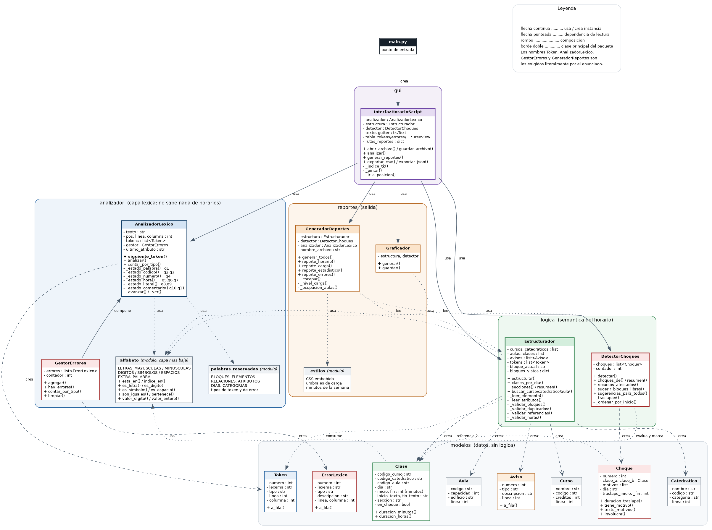
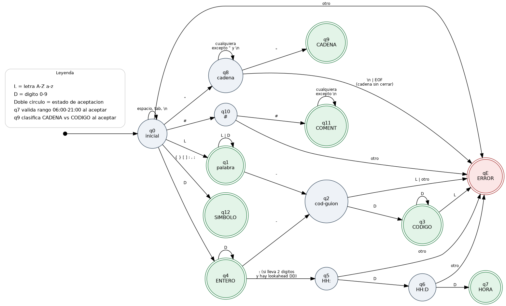

# Manual Técnico

## HorarioScript — Analizador léxico para horarios académicos

**Proyecto 1** · Lenguajes Formales y de Programación
Facultad de Ingeniería, Universidad de San Carlos de Guatemala
Sección B+ · Segundo semestre 2026

---

## Contenido

1. [Propósito y alcance](#1-propósito-y-alcance)
2. [Requisitos y ejecución](#2-requisitos-y-ejecución)
3. [Arquitectura del sistema](#3-arquitectura-del-sistema)
4. [Diagrama de clases](#4-diagrama-de-clases)
5. [Definición formal del lenguaje](#5-definición-formal-del-lenguaje)
6. [Diseño del AFD](#6-diseño-del-afd)
7. [Algoritmo de tokenización](#7-algoritmo-de-tokenización)
8. [Gestión de errores y modo pánico](#8-gestión-de-errores-y-modo-pánico)
9. [Del flujo de tokens a los objetos del horario](#9-del-flujo-de-tokens-a-los-objetos-del-horario)
10. [Lógica de detección de choques](#10-lógica-de-detección-de-choques)
11. [Sugerencia de bloques libres](#11-sugerencia-de-bloques-libres)
12. [Generación de reportes](#12-generación-de-reportes)
13. [Justificación de las decisiones de diseño](#13-justificación-de-las-decisiones-de-diseño)
14. [Observaciones sobre el enunciado](#14-observaciones-sobre-el-enunciado)
15. [Errores encontrados durante el desarrollo](#15-errores-encontrados-durante-el-desarrollo)
16. [Limitaciones conocidas](#16-limitaciones-conocidas)

---

## 1. Propósito y alcance

HorarioScript procesa archivos `.hor` escritos en un mini-lenguaje de dominio
específico que describe la programación académica de una facultad: cursos,
catedráticos, aulas y bloques de clase.

El sistema hace cuatro cosas:

1. **Analiza léxicamente** el archivo mediante un Autómata Finito
   Determinista implementado a mano, produciendo una tabla de tokens con la
   posición exacta de cada lexema.
2. **Detecta y reporta errores léxicos** sin detenerse en el primero, de modo
   que una sola pasada revela todos los problemas del archivo.
3. **Detecta choques de horario**: casos en que un mismo catedrático o una
   misma aula tienen dos clases traslapadas el mismo día.
4. **Genera cuatro reportes HTML** con CSS embebido y el código DOT de la
   jerarquía del horario.

No se usa el módulo `re`, ni generadores de analizadores como `ply`, ni
funciones de alto nivel de cadenas para la tokenización. Todo el recorrido del
texto es carácter por carácter mediante indexación.

---

## 2. Requisitos y ejecución

| Requisito | Versión | Obligatorio |
|---|---|---|
| Python | 3.10 o superior | sí |
| Tkinter | incluido en la biblioteca estándar | sí |
| Graphviz | cualquiera | no, solo para renderizar los `.dot` |

No hay dependencias externas. No hay `pip install` que ejecutar.

```bash
python main.py                                  # ventana vacía
python main.py entradas/horario_completo.hor    # abre y analiza
```

Verificación desde consola, sin abrir la interfaz:

```bash
python pruebas_casos.py        # los 8 casos de prueba con aserciones
python pruebas_consola.py      # motor léxico
python pruebas_estructura.py   # objetos del horario
python pruebas_choques.py      # choques y bloques libres
python pruebas_reportes.py     # genera los HTML
```

---

## 3. Arquitectura del sistema

El sistema está organizado en cinco capas. La regla que las ordena es una
sola: **cada capa solo conoce a la que tiene debajo**.

```
                        ┌──────────────────┐
                        │       gui        │   InterfazHorarioScript
                        └────────┬─────────┘
             ┌───────────────────┼───────────────────┐
             ▼                   ▼                   ▼
      ┌────────────┐      ┌────────────┐      ┌────────────┐
      │ analizador │      │   logica   │      │  reportes  │
      └──────┬─────┘      └──────┬─────┘      └──────┬─────┘
             └───────────────────┼───────────────────┘
                                 ▼
                          ┌────────────┐
                          │  modelos   │   datos, sin lógica
                          └────────────┘
```

| Capa | Responsabilidad | Qué **no** hace |
|---|---|---|
| `modelos` | Contener datos. `Token`, `ErrorLexico`, `Aviso`, `Curso`, `Catedratico`, `Aula`, `Clase`, `Choque`. | No valida ni calcula nada del negocio. |
| `analizador` | Convertir texto en tokens. El AFD, el gestor de errores, las funciones de alfabeto. | **No sabe nada de horarios.** No conoce el concepto de clase, de traslape ni de aula. |
| `logica` | Semántica del horario: armar los objetos desde los tokens y detectar conflictos. | No genera HTML ni sabe de Tkinter. |
| `reportes` | Producir HTML y DOT. | No calcula conflictos; los lee del detector. |
| `gui` | Orquestar y presentar. | No contiene lógica de análisis. |

### Por qué esta separación

El punto no es estético. `analizador/` no importa nada de `logica/`, lo que
significa que el motor léxico es **reutilizable tal cual en el Proyecto 2**,
donde habrá que construir un analizador sintáctico sobre el mismo flujo de
tokens. Si el AFD supiera qué es un choque de horario, habría que
desenredarlo primero.

La consecuencia práctica se ve en la GUI: la interfaz encadena las tres
capas en ese orden y cada una recibe la salida de la anterior.

```python
analizador = AnalizadorLexico()
analizador.analizar(contenido)              # texto  -> tokens

estructura = Estructurador()
estructura.estructurar(analizador.tokens)   # tokens -> objetos

detector = DetectorChoques()
detector.detectar(estructura)               # objetos -> choques
```

### Estructura de archivos

```
Proyecto1/
├── main.py                     punto de entrada
├── analizador/
│   ├── alfabeto.py             pertenencia al alfabeto con ord()
│   ├── palabras_reservadas.py  catálogo de tokens y tipos de error
│   ├── analizador_lexico.py    el AFD
│   └── gestor_errores.py       acumulación en modo pánico
├── modelos/
│   ├── token.py, error_lexico.py
│   ├── elementos.py            Curso, Catedratico, Aula, Clase, Aviso
│   └── choque.py
├── logica/
│   ├── estructurador.py        tokens -> objetos
│   └── detector_choques.py     traslapes y reprogramación
├── reportes/
│   ├── estilos.py              CSS embebido y umbrales
│   ├── generador.py            los cuatro reportes HTML
│   └── graficador.py           DOT de la jerarquía
├── gui/interfaz.py
├── entradas/                   archivos .hor de prueba
├── diseno/                     diagramas en DOT y PNG
├── pruebas/                    casos de prueba y su registro
└── salida/                     reportes generados
```

---

## 4. Diagrama de clases



Archivo fuente: `diseno/diagrama_clases.dot`

```bash
dot -Tpng diseno/diagrama_clases.dot -o diseno/diagrama_clases.png
```

Los nombres `Token`, `AnalizadorLexico`, `GestorErrores` y
`GeneradorReportes` son los exigidos literalmente por el enunciado. Las demás
clases (`Estructurador`, `DetectorChoques`, `Aviso`, `Choque`, `Graficador`)
son decisiones propias de diseño, necesarias para cumplir la detección de
choques y la generación de reportes sin cargar de responsabilidades al
analizador.

### Relaciones principales

| Origen | Relación | Destino |
|---|---|---|
| `alfabeto` | lo usan | `AnalizadorLexico`, `Estructurador`, `elementos`, `Graficador` |
| `AnalizadorLexico` | compone | `GestorErrores` |
| `AnalizadorLexico` | crea | `Token` |
| `GestorErrores` | crea | `ErrorLexico` |
| `Estructurador` | consume | `Token` |
| `Estructurador` | crea | `Curso`, `Catedratico`, `Aula`, `Clase`, `Aviso` |
| `DetectorChoques` | evalúa y marca | `Clase` |
| `DetectorChoques` | crea | `Choque` |
| `Choque` | referencia dos | `Clase` |
| `GeneradorReportes` | lee | `Estructurador`, `DetectorChoques` |
| `InterfazHorarioScript` | usa | todas las anteriores |

---

## 5. Definición formal del lenguaje

### 5.1 Alfabeto

Σ = L ∪ D ∪ G ∪ P ∪ Q ∪ N ∪ S ∪ W

| Subconjunto | Contenido |
|---|---|
| L (letras) | `A`–`Z`, `a`–`z` |
| D (dígitos) | `0`–`9` |
| G (guión) | `-` |
| P (dos puntos) | `:` |
| Q (comilla) | `"` |
| N (numeral) | `#` |
| S (símbolos) | `{` `}` `[` `]` `,` `;` |
| W (espacios) | espacio, `\t`, `\r`, `\n` |

Cada subconjunto se declara como una **lista explícita de caracteres** en
`analizador/alfabeto.py`, y la pertenencia se resuelve recorriendo la lista.
No se usa `str.isalpha()` ni `str.isdigit()`, ni comparaciones de rango
numérico:

```python
LETRAS_MAYUSCULAS = ['A', 'B', 'C', ..., 'Z']
LETRAS_MINUSCULAS = ['a', 'b', 'c', ..., 'z']
DIGITOS = ['0', '1', '2', ..., '9']
EXTRA_PALABRA = []        # caracteres extra dentro de una palabra

def esta_en(c, lista):
    i = 0
    while i < len(lista):
        if c == lista[i]:
            return True
        i = i + 1
    return False

def es_letra(c):
    if c == '':
        return False
    if esta_en(c, LETRAS_MAYUSCULAS):
        return True
    if esta_en(c, LETRAS_MINUSCULAS):
        return True
    return False
```

La conversión de dígito a número sale de la **posición** del carácter en
`DIGITOS`: el `'0'` está en el índice 0, el `'7'` en el índice 7. Así
`valor_entero()` no necesita `int()` ni restar 48:

```python
def valor_digito(c):
    return indice_en(c, DIGITOS)
```

El motivo de esta forma está en la decisión D-12.

Dentro de un literal entre comillas se acepta **cualquier** carácter Unicode
excepto `\n` y `"`. Eso incluye tildes y `ñ`, que fuera de las comillas se
reportan como `CARACTER_NO_RECONOCIDO`.

### 5.2 Catálogo de tokens

Son 12 tipos, dos más del mínimo exigido de 10.

| # | Tipo | Regla | Ejemplo |
|---|---|---|---|
| 1 | `RESERVADA_BLOQUE` | `HORARIO` `CURSOS` `CATEDRATICOS` `AULAS` `CLASES` | `HORARIO` |
| 2 | `RESERVADA_ELEMENTO` | `curso` `catedratico` `aula` `clase` | `curso` |
| 3 | `RESERVADA_RELACION` | `con` `en` | `con` |
| 4 | `RESERVADA_ATRIBUTO` | `codigo` `creditos` `categoria` `capacidad` `edificio` `dia` `inicio` `fin` `seccion` | `creditos` |
| 5 | `DIA` | `LUNES` … `SABADO` | `MARTES` |
| 6 | `CATEGORIA` | `TITULAR` `INTERINO` `AUXILIAR` | `TITULAR` |
| 7 | `CODIGO` | `L (L\|D)* - D+`, con o sin comillas | `"LFP-0796"` |
| 8 | `CADENA` | `" (Σ* − {", \n}) "` | `"Bases de Datos 2"` |
| 9 | `HORA` | `DD:DD`, rango 06:00–21:00 | `07:00` |
| 10 | `ENTERO` | `D+` | `40` |
| 11 | `SIMBOLO` | `{` `}` `[` `]` `:` `,` `;` — uno por token | `[` |
| 12 | `COMENTARIO_LINEA` | `##` hasta `\n` o EOF | `## Ciclo 2026` |

Las palabras reservadas son **sensibles a mayúsculas**: `HORARIO` es
palabra reservada de bloque, `horario` es una palabra desconocida. El
lenguaje usa mayúsculas para bloques y enumeraciones, minúsculas para
elementos y atributos.

### 5.3 Catálogo de errores léxicos

| Tipo | Cuándo se emite |
|---|---|
| `CARACTER_NO_RECONOCIDO` | El carácter no inicia ningún patrón válido (`@`, `%`, `~`), o una palabra alfabética no coincide con nada. |
| `CADENA_SIN_CERRAR` | Se abrió `"` y se llegó a fin de línea o EOF sin cierre. Se reporta la posición de **apertura**. |
| `HORA_FUERA_DE_RANGO` | `HH:MM` bien formado pero fuera de 06:00–21:00, o con minutos > 59, o con dígitos sobrantes (`07:000`). |
| `DIA_NO_RECONOCIDO` | El valor de `dia` o de `categoria` no coincide con la enumeración. |
| `CODIGO_MAL_FORMADO` | El literal parece un código pero no cumple `L (L\|D)* - D+`. |

---

## 6. Diseño del AFD

### 6.1 Estados

| Estado | Nombre | Descripción | Acepta |
|---|---|---|---|
| q0 | INICIAL | Punto de partida y retorno tras cada token | — |
| q1 | PALABRA | Consumiendo `L (L\|D)*` | ✔ palabra reservada o desconocida |
| q2 | COD_GUION | Se leyó `L+-`, se esperan dígitos | ✘ |
| q3 | COD_DIGITOS | Se leyó `L+-D+` | ✔ `CODIGO` |
| q4 | NUMERO | Consumiendo `D+` | ✔ `ENTERO` |
| q5 | HORA_SEP | Se leyó `DD:` | ✘ |
| q6 | HORA_MIN1 | Se leyó `DD:D` | ✘ |
| q7 | HORA_COMPLETA | Se leyó `DD:DD` | ✔ `HORA` |
| q8 | CADENA_ABIERTA | Dentro de un literal | ✘ |
| q9 | CADENA_CERRADA | Se leyó el `"` de cierre | ✔ `CADENA` o `CODIGO` |
| q10 | NUMERAL1 | Se leyó un `#` | ✘ |
| q11 | COMENTARIO | Dentro de `##…` | ✔ `COMENTARIO_LINEA` |
| q12 | SIMBOLO | Se leyó un símbolo estructural | ✔ `SIMBOLO` |
| qE | ERROR | Carácter fuera del alfabeto | ✔ emite error |

Estados de aceptación: F = {q1, q3, q4, q7, q9, q11, q12, qE}

### 6.2 Tabla de transiciones

Un guión (`—`) significa que no hay transición: si el estado es de
aceptación, se emite el token y se vuelve a q0 **sin consumir** el carácter
actual; si no lo es, se emite un error.

| Estado \ Entrada | L | D | `-` | `:` | `"` | `#` | S | W | O |
|---|---|---|---|---|---|---|---|---|---|
| **q0** | q1 | q4 | qE | q12 | q8 | q10 | q12 | q0 | qE |
| **q1** | q1 | q1 | q2 | — | — | — | — | — | — |
| **q2** | qE | q3 | qE | — | — | — | — | — | — |
| **q3** | qE | q3 | qE | — | — | — | — | — | — |
| **q4** | qE | q4 | q2 | q5 ⁽¹⁾ | — | — | — | — | — |
| **q5** | qE | q6 | qE | qE | qE | qE | qE | qE | qE |
| **q6** | qE | q7 | qE | qE | qE | qE | qE | qE | qE |
| **q7** | — | — | — | — | — | — | — | — | — |
| **q8** | q8 | q8 | q8 | q8 | q9 | q8 | q8 | q8 ⁽²⁾ | q8 |
| **q9** | — | — | — | — | — | — | — | — | — |
| **q10** | qE | qE | qE | qE | qE | q11 | qE | qE | qE |
| **q11** | q11 | q11 | q11 | q11 | q11 | q11 | q11 | q11 ⁽³⁾ | q11 |
| **q12** | — | — | — | — | — | — | — | — | — |

⁽¹⁾ Solo si el contador de dígitos es exactamente 2 **y** el lookahead
confirma dos dígitos después. Si no, q4 acepta como `ENTERO` y el `:` se
tokeniza aparte como `SIMBOLO`.
⁽²⁾ Excepto `\n`, que dispara `CADENA_SIN_CERRAR` reportando la posición de
apertura del literal.
⁽³⁾ Excepto `\n`, que cierra el comentario y acepta `COMENTARIO_LINEA`.

### 6.3 Diagrama del AFD



Archivo fuente: `diseno/afd_horarioscript.dot`

```bash
dot -Tpng diseno/afd_horarioscript.dot -o diseno/afd_horarioscript.png
```

### 6.4 Correspondencia entre estados y código

Cada estado del autómata corresponde a un método privado del analizador, lo
que permite leer el código contra la tabla de transiciones.

| Estados | Método en `analizador_lexico.py` |
|---|---|
| q0 | `siguiente_token()` |
| q1 | `_estado_palabra()` y `_clasificar_palabra()` |
| q2, q3 | `_estado_codigo()` |
| q4 | `_estado_numero()` |
| q5, q6, q7 | `_estado_hora()` |
| q8, q9 | `_estado_literal()` y `_clasificar_literal()` |
| q10, q11 | `_estado_comentario()` |
| q12 | `siguiente_token()`, aceptación inmediata |
| qE | delegado a `GestorErrores` |

---

## 7. Algoritmo de tokenización

### 7.1 Estructura general

El método público `siguiente_token()` implementa q0: salta los espacios,
mira el primer carácter y delega al método del estado correspondiente.

```
siguiente_token():
    saltar espacios en blanco
    si no hay más texto: devolver None            (fin de archivo)

    c ← carácter actual
    guardar linea_ini, col_ini

    si es_letra(c):      → _estado_palabra()
    si es_digito(c):     → _estado_numero()
    si c == '"':         → _estado_literal()
    si c == '#':         → _estado_comentario()
    si es_simbolo(c):    consumir y devolver SIMBOLO
    en otro caso:        consumir, registrar error, devolver None
```

El bucle que recorre el archivo distingue el fin de archivo de un error
consultando si queda texto:

```
analizar():
    repetir:
        token ← siguiente_token()
        si token es None:
            si no hay más texto: terminar         (fin de archivo)
            continuar                             (error: seguir analizando)
        agregar token a la lista
```

### 7.2 Control de posición

`_avanzar()` es el único punto donde se consume un carácter, y por eso el
único donde se actualiza la posición:

```python
def _avanzar(self):
    c = self.texto[self.pos]
    self.pos = self.pos + 1
    if c == '\n':
        self.linea = self.linea + 1
        self.columna = 1
    elif c == '\t':
        self.columna = self.columna + ANCHO_TABULACION   # 4
    elif c == '\r':
        pass                      # archivos con CRLF de Windows
    else:
        self.columna = self.columna + 1
    return c
```

Tres decisiones concentradas aquí:

- **Un tabulador cuenta 4 columnas.** El criterio 2.1 del enunciado exige
  precisión con tabulaciones, y no definir el ancho dejaría las columnas
  reportadas sin significado.
- **El retorno de carro avanza la posición sin mover la columna.** Un archivo
  creado en Windows usa `\r\n`; si `\r` contara como columna, todas las
  posiciones de la línea siguiente saldrían corridas en uno.
- **El salto de línea reinicia la columna a 1**, no a 0. Las posiciones son
  base 1 porque así las espera un usuario leyendo la tabla de errores.

### 7.3 Lookahead sin retroceso

La ambigüedad entre `HORA` y `ENTERO` se resuelve con `_ver(desplazamiento)`,
que mira adelante **sin consumir**:

```python
def _ver(self, desplazamiento):
    indice = self.pos + desplazamiento
    if indice < len(self.texto):
        return self.texto[indice]
    return ''
```

En `_estado_numero()`:

```python
if len(lexema) == 2 and self._actual() == ':':
    if alf.es_digito(self._ver(1)) and alf.es_digito(self._ver(2)):
        return self._estado_hora(lexema, linea_ini, col_ini)
    # sin lookahead válido: no se consume el ':', que será SIMBOLO
```

Como el lookahead no consume, **el autómata nunca necesita retroceder el
índice**. El diseño inicial preveía guardar y restaurar `pos` y `columna`;
la implementación con lookahead no consumidor lo volvió innecesario y dejó
el código sin puntos de rollback, que son la fuente habitual de errores de
posición en analizadores escritos a mano.

### 7.4 Clasificación en la aceptación de q1

Al aceptar en q1, el lexema se compara contra las listas en orden, de la más
específica a la más general:

```
1. ¿Está en BLOQUES?     → RESERVADA_BLOQUE
2. ¿Está en ELEMENTOS?   → RESERVADA_ELEMENTO
3. ¿Está en RELACIONES?  → RESERVADA_RELACION
4. ¿Está en ATRIBUTOS?   → RESERVADA_ATRIBUTO  (se recuerda cuál)
5. ¿Está en DIAS?        → DIA
6. ¿Está en CATEGORIAS?  → CATEGORIA
7. en otro caso          → palabra desconocida → capa de errores
```

La comparación se hace con `son_iguales()`, que recorre las dos cadenas
carácter por carácter. Se implementó a mano en lugar de usar `==` para dejar
constancia de que también la búsqueda de palabras reservadas opera a bajo
nivel.

---

## 8. Gestión de errores y modo pánico

El enunciado exige que el análisis **no se detenga** ante el primer error.
`GestorErrores` acumula los errores y el analizador continúa desde el
siguiente carácter válido.

La estrategia de recuperación es: **consumir todo el lexema problemático
antes de reportar**. Es importante y no es obvio. Si al encontrar `"CMP-"`
se reportara el error en el guión y se devolviera el control, los caracteres
restantes generarían una cascada de errores falsos. Consumiendo el lexema
completo, un código mal formado produce **un** error.

Lo mismo aplica a las horas: `07:000` se consume entero, incluyendo los
dígitos sobrantes, para no dejar un `ENTERO` fantasma después.

### Verificación

`entradas/horario_errores.hor` tiene un error de cada tipo, uno por línea.
Resultado de una sola pasada:

| Métrica | Valor |
|---|---|
| Errores reportados | 10 |
| Tipos de error distintos | 5 (los cinco del enunciado) |
| Tokens válidos producidos **después** de los errores | 132 |
| Avisos estructurales derivados | 13 |

Los 132 tokens son la prueba de que el analizador no abortó: siguió
reconociendo el resto del archivo.

---

## 9. Del flujo de tokens a los objetos del horario

El `Estructurador` es la segunda pasada. Recibe la lista plana de tokens y
reconstruye los objetos del horario.

### 9.1 No es un analizador sintáctico

Es un **recorrido dirigido por palabras clave**: avanza por la lista y
reacciona a los tokens `RESERVADA_ELEMENTO` (`curso`, `catedratico`, `aula`,
`clase`), leyendo lo que viene después. No valida la gramática ni construye
un árbol.

Esa elección es deliberada, por dos razones:

1. El Proyecto 1 solo exige análisis léxico. Un parser formal corresponde al
   Proyecto 2, y adelantarlo sería alcance que nadie pidió.
2. El archivo puede traer errores léxicos, así que faltarán tokens en medio
   del flujo. Un recorrido tolerante sigue armando lo que sí se puede armar;
   un parser estricto abortaría y dejaría los reportes vacíos, que es
   justamente lo contrario de lo que el usuario necesita cuando está
   corrigiendo un archivo.

### 9.2 Lectura de un elemento

```
_leer_elemento():
    consumir la palabra de elemento
    si el bloque actual no es el esperado → aviso BLOQUE_INCORRECTO
    consumir ':'  (si falta → aviso, saltar al siguiente elemento)

    según el elemento:
        curso        → identificador, luego atributos
        catedratico  → identificador, luego atributos
        aula         → identificador, luego atributos
        clase        → código, 'con' código, 'en' código, luego atributos
```

Los atributos se leen del bloque `[ atributo: valor, … ]` a un diccionario
`{nombre: token_valor}`.

### 9.3 La guarda de delimitadores

Es la parte más delicada de esta capa. Cuando el AFD descarta un valor por
ser un error léxico —por ejemplo `dia: LUNEZ`— ese lexema **nunca llega como
token**. Un lector ingenuo tomaría el siguiente token, que es la coma, como
si fuera el valor del atributo, y el resto de la lista se leería corrida:

```
[dia: LUNEZ, inicio: 07:00, fin: 08:40]

tokens que llegan:  dia  :  ,  inicio  :  07:00  ,  fin  :  08:40
lectura ingenua:    dia = ','      inicio = '07:00'   fin = '08:40'
                          ↑ mal
```

La solución es rechazar los delimitadores como valor antes de consumirlos:

```python
if self._es_delimitador(self._actual()) or \
        self._actual().tipo == pr.T_RESERVADA_ATRIBUTO:
    self._aviso(A_VALOR_PERDIDO,
                "el valor de '" + nombre + "' no llegó como token; "
                "revise la tabla de errores léxicos", token.linea)
    atributos[nombre] = None
    continue
```

El atributo se registra con valor `None` en lugar de omitirse, para que los
extractores no vuelvan a avisar «atributo faltante» por lo mismo y el
usuario vea **un** aviso por problema.

### 9.4 Avisos: qué son y qué no son

Un `Aviso` es una inconsistencia **estructural o de referencia**, no un error
léxico. Los errores léxicos los produce el AFD y viven en `GestorErrores`;
los avisos aparecen después, cuando el flujo de tokens ya es válido pero el
contenido no cuadra.

Se muestran en un panel aparte de la interfaz y en una tabla aparte del
reporte, para no confundir al usuario ni al evaluador sobre qué detecta el
AFD y qué no.

| Tipo de aviso | Cuándo |
|---|---|
| `BLOQUE_DUPLICADO` | Un bloque aparece más de una vez. |
| `BLOQUE_FALTANTE` | Falta uno de los cinco bloques. Se reporta en línea 0 porque no tiene posición: el problema es que no está. |
| `BLOQUE_INCORRECTO` | Un `curso` declarado dentro de `AULAS`, por ejemplo. |
| `ESTRUCTURA_INCOMPLETA` | Falta un `:`, un `[`, un `]`, o una relación `con`/`en`. |
| `ATRIBUTO_FALTANTE` | El elemento no declara un atributo requerido. |
| `VALOR_PERDIDO` | El valor del atributo se perdió por un error léxico. |
| `TIPO_INCORRECTO` | El valor es de un tipo de token distinto al esperado. |
| `CODIGO_DUPLICADO` | Dos cursos, catedráticos o aulas con el mismo código. |
| `REFERENCIA_INEXISTENTE` | Una clase referencia un código no declarado. |
| `RANGO_INVALIDO` | La hora de fin es anterior o igual a la de inicio. |

### 9.5 Clases descartadas

Una clase sin día, sin hora de inicio o sin hora de fin **se descarta** en
lugar de guardarse con valores vacíos. Sin día no hay traslape que evaluar, y
guardarla produciría falsos negativos en el detector de choques. El descarte
se reporta como `ESTRUCTURA_INCOMPLETA` para que el usuario sepa que esa
clase no entró en el análisis.

---

## 10. Lógica de detección de choques

### 10.1 Definición

Dos clases chocan si se cumplen las tres condiciones **a la vez**:

1. Están el mismo día.
2. Sus intervalos de tiempo se traslapan.
3. Comparten catedrático **o** comparten aula.

La tercera condición es la que distingue un conflicto real de una
coincidencia normal: dos clases distintas a la misma hora, en aulas
distintas y con catedráticos distintos, es exactamente cómo funciona una
facultad.

### 10.2 La condición de traslape

```
traslapan(a, b)  ⟺  a.inicio < b.fin  ∧  b.inicio < a.fin
```

La desigualdad es **estricta en ambos lados**, y esa es la decisión más
importante de todo el módulo. Una clase que termina 08:40 y otra que empieza
08:40 comparten un instante, pero eso es **continuidad, no conflicto**. Con
`<=` en lugar de `<`, todo horario encadenado de la facultad se reportaría
como choque, que es precisamente el falso positivo que el criterio 2.5
penaliza.

Las horas se guardan en dos formas dentro de `Clase`: el texto original
(`'07:00'`) para mostrarlo tal cual en los reportes, y los minutos desde
medianoche (`420`) para comparar con enteros. Guardar ambas evita reconvertir
en cada comparación y mantiene los reportes fieles al archivo de entrada.

### 10.3 Algoritmo

```
detectar(estructura):
    limpiar la bandera en_choque de todas las clases
    agrupar las clases por día
    para cada día en orden LUNES..SABADO:
        ordenar las clases del día por hora de inicio
        para cada par (a, b) del día:
            si a o b tienen rango inválido: saltar
            si no traslapan: saltar
            motivos ← []
            si comparten catedrático: motivos += CATEDRATICO
            si comparten aula:        motivos += AULA
            si motivos está vacío: saltar
            registrar Choque(a, b, motivos, ventana de traslape)
            marcar a.en_choque y b.en_choque
```

**Complejidad.** O(n²) sobre los grupos de cada día. Agrupar primero por día
reduce el problema a una fracción del total, y un horario de facultad tiene
decenas de clases por día, no miles. No vale la pena una estructura más
elaborada; la claridad del código pesa más aquí.

**Orden determinista.** Se recorre en el orden `LUNES..SABADO` y se ordena
cada día por hora de inicio (ordenamiento por inserción sobre una copia).
Así la numeración de los choques es estable entre ejecuciones y el reporte se
lee siguiendo el reloj.

### 10.4 Regla de conteo

Se registra **un `Choque` por cada par de clases en conflicto, no uno por
motivo**. Si dos clases comparten a la vez catedrático y aula, es un solo
choque con dos motivos.

La razón es de consistencia con los reportes: contar por motivo inflaría el
total y haría que el indicador «choques detectados» del Reporte 3 no
coincidiera con las celdas rojas del Reporte 1.

Consecuencia que conviene anticipar: **tres clases mutuamente traslapadas
producen tres choques**, porque son tres pares. No es un error de conteo,
es la definición por pares aplicada consistentemente.

### 10.5 Resultados verificados

Sobre `entradas/horario_choques_borde.hor`:

| Situación | Resultado |
|---|---|
| Mismo catedrático y misma aula, misma hora | 1 choque, 2 motivos |
| Contención total (07:00–12:00 vs 09:00–10:00) | 1 choque |
| Tres clases mutuamente traslapadas | 3 choques |
| Termina 08:40 / empieza 08:40, mismo catedrático | **0 choques** |
| Misma hora, días distintos | **0 choques** |
| Misma hora, sin recurso compartido | **0 choques** |

---

## 11. Sugerencia de bloques libres

Funcionalidad opcional de la sección 4.2 del enunciado, la más compleja de
esa lista.

Para una clase en conflicto, `sugerir_bloques_libres()` recorre el día en una
rejilla de 20 minutos dentro del rango institucional y devuelve los bloques
donde el catedrático **y** el aula están libres, manteniendo la duración
original de la clase.

```
sugerir_bloques_libres(estructura, clase):
    duracion ← clase.fin - clase.inicio
    si duracion <= 0: devolver []

    bloqueantes ← clases del mismo día que comparten
                  catedrático o aula con 'clase', EXCLUYENDO 'clase'

    inicio ← 06:00 en minutos (360)
    mientras inicio + duracion <= 21:00 en minutos (1260):
        si el bloque [inicio, inicio+duracion) no traslapa
           con ningún bloqueante:
               agregar sugerencia
        inicio ← inicio + 20
```

Dos detalles del diseño:

- **El paso es de 20 minutos** porque los bloques institucionales arrancan
  en `:00`, `:20` y `:40`. Un paso de 1 minuto daría cientos de sugerencias
  casi idénticas, inútiles para el usuario.
- **La propia clase se excluye de los bloqueantes.** Se la está moviendo, así
  que su horario actual no debe bloquearse a sí mismo. Sin esta exclusión, el
  algoritmo nunca sugeriría el horario que la clase ya ocupa ni ninguno que
  se le traslape, que es un error sutil y difícil de notar.

Verificación: en un día ocupado de 06:00 a 21:00, la función devuelve
correctamente una lista vacía.

---

## 12. Generación de reportes

Los cuatro reportes se escriben con CSS **embebido**, no enlazado. La razón:
cada archivo debe abrirse en cualquier navegador como archivo suelto, sin
depender de rutas relativas ni de conexión a internet. Por el mismo motivo no
se usan fuentes web, solo tipografías del sistema.

### 12.1 Escapado de HTML

El reporte de errores muestra lexemas inválidos tal como venían en el
archivo. Si un `.hor` contiene `<script>`, escribirlo sin escapar rompería la
página o inyectaría etiquetas. `_escapar()` neutraliza `&`, `<`, `>` y `"`
recorriendo la cadena carácter por carácter. El caso 8 de las pruebas lo
verifica.

### 12.2 Reporte 1 — Horario semanal por sección

Un solo archivo con una rejilla por sección. El enunciado pide el reporte
«por cada sección presente en el archivo»; generar N archivos sueltos obliga
a abrirlos uno por uno y complica las capturas del manual.

**Las filas de la rejilla se derivan de los bloques que realmente aparecen en
el archivo**, no de una retahíla fija de 06:00 a 21:00 cada 20 minutos. Una
rejilla fija generaría unas 45 filas, casi todas vacías.

Cada celda tiene tres estados posibles, no dos:

| Estado | Color | Cuándo |
|---|---|---|
| `CONFIRMADO` | verde | El bloque no compite con ningún otro. |
| `CHOQUE DE HORARIO` | rojo | El catedrático o el aula ya están ocupados. |
| `REVISAR RANGO` | naranja | La hora de fin es anterior o igual a la de inicio. |

El tercer estado no lo pide el enunciado, pero era necesario: una clase que
termina antes de empezar aparecía pintada de verde como «confirmada», lo cual
es falso. El bloque no es válido aunque no choque con nadie.

### 12.3 Reporte 2 — Carga de catedráticos

Los umbrales son los sugeridos por el enunciado y se dejan como constantes en
`reportes/estilos.py` para poder ajustarlos:

| Nivel | Horas semanales | Color |
|---|---|---|
| BAJA | 1 – 4 | azul |
| NORMAL | 5 – 10 | verde |
| ALTA | 11 – 15 | naranja |
| SATURADA | 16 o más | rojo |

Las horas se calculan **sumando la duración real de cada bloque**, no
contando clases. Las clases con rango invertido se excluyen de la suma:
aportarían duración negativa (ver sección 15).

### 12.4 Reporte 3 — Estadístico general

**La ocupación de aulas se mide en tiempo, no en cantidad de clases:**

```
% ocupación = minutos asignados / (6 días × 15 horas)
            = minutos asignados / 5400
```

Contar clases daría porcentajes sin sentido, porque un bloque de 100 minutos
y uno de 50 pesarían igual. Las aulas por encima del 80% se resaltan en rojo,
según el enunciado.

Consecuencia a tener en cuenta al interpretar el reporte: con un denominador
de 90 horas semanales, un aula con tres clases de 100 minutos sale al 5.6%.
Los porcentajes bajos no indican un error de cálculo, indican que el archivo
de entrada es pequeño. `entradas/horario_completo.hor` incluye a propósito un
laboratorio ocupado de 06:00 a 19:00 los seis días, que llega al 86.7% y
dispara el resaltado en rojo.

### 12.5 Reporte de errores

Cuarto reporte HTML, exigido por la sección 4.8 del enunciado («tanto en la
interfaz gráfica como en un reporte HTML adicional»). Contiene la tabla de
errores léxicos, la tabla de avisos estructurales y la frecuencia de tokens
por tipo.

### 12.6 Diagrama de jerarquía en DOT

`Graficador` emite el código DOT con la jerarquía del horario y las
relaciones curso-catedrático-aula. Las aristas de las clases en choque se
dibujan en rojo y punteadas, de modo que el conflicto se ve en el grafo y no
solo en la tabla.

Se usa `rankdir = LR` por defecto. Con `TB`, un horario de 22 clases produjo
un grafo de 4381 px de ancho, ilegible; en `LR` crece hacia abajo y cabe en
una página vertical.

El método devuelve **texto**. Renderizar a PNG requiere Graphviz instalado y
queda a cargo del usuario, para que el proyecto no dependa de un binario
externo en tiempo de ejecución.

---

## 13. Justificación de las decisiones de diseño

### D-01 · `"LFP-0796"` se clasifica como `CODIGO`, no como `CADENA`

**El problema.** El enunciado presenta los códigos entre comillas
(`"LFP-0796"`, `"A-101"`) pero también define `CADENA` como todo texto entre
comillas dobles. Las dos reglas se solapan.

**La decisión.** Al cerrar el literal, el AFD clasifica el contenido:

- Si **no tiene espacios** y contiene **exactamente un guión**, es candidato a
  código. Se valida `L (L|D)* - D+`:
  - válido → `CODIGO`
  - inválido → `CODIGO_MAL_FORMADO`
- En cualquier otro caso → `CADENA`

**Por qué.** La regla es puramente léxica, no mira el contexto, y hace
**alcanzable** el error `CODIGO_MAL_FORMADO`. Con la interpretación
alternativa —todo literal es cadena— ese error nunca se dispararía y se
perdería el criterio 2.4.

La condición «sin espacios» evita clasificar mal un título como
`"Redes - Avanzadas"`, que tiene un guión pero es claramente una cadena.

### D-02 · Resolución de `07:00` frente a `07` seguido de `:`

Al leer dígitos, el AFD cuenta cuántos lleva. Si lleva exactamente 2 y el
siguiente carácter es `:`, hace un lookahead de dos posiciones **sin
consumir**. Si vienen dos dígitos, emite `HORA`; si no, emite `ENTERO` con
los dos dígitos y deja el `:` para tokenizarlo como `SIMBOLO`.

El diseño inicial contemplaba guardar y restaurar `pos` y `columna`. El
lookahead no consumidor volvió el retroceso innecesario, lo que elimina la
fuente habitual de errores de posición en analizadores escritos a mano.

### D-03 · El prefijo de un código admite dígitos

El enunciado describe el patrón como «letras + guión + dígitos», pero su
propio archivo de ejemplo usa `BD2-0812`, cuyo prefijo contiene un dígito. El
patrón implementado es `L (L|D)* - D+`: empieza con letra, admite
alfanuméricos, un guión, y solo dígitos después.

Tomar la descripción literal habría hecho fallar el ejemplo oficial del
enunciado.

### D-04 · Rango de hora y consumo completo del lexema

Una hora bien formada pero fuera de 06:00–21:00 se consume **completa** como
lexema y se reporta `HORA_FUERA_DE_RANGO`. Consumirla completa evita que los
caracteres restantes generen una cascada de errores falsos.

La validación se hace en minutos desde medianoche, con el rango
[360, 1260] inclusive. Así `21:30` queda fuera, no solo `22:00`. Los
minutos mayores a 59 se rechazan aparte.

### D-05 · Detección de `DIA_NO_RECONOCIDO` con memoria de un token

**El problema.** Un lexer puro no puede saber que `LUNEZ` pretendía ser un
día: solo ve una palabra alfabética desconocida.

**La decisión.** El analizador guarda el último `RESERVADA_ATRIBUTO` emitido.
Si aparece una palabra desconocida y el último atributo fue `dia`, se reporta
`DIA_NO_RECONOCIDO`; si fue `categoria`, el mismo tipo con mensaje adaptado;
en cualquier otro punto, `CARACTER_NO_RECONOCIDO` sobre el lexema completo.

**Aclaración importante.** Esto es una capa de clasificación **posterior** al
AFD, no una transición del autómata. El AFD sigue siendo determinista y sin
contexto; la memoria de un token vive fuera de la función de transición. La
memoria se reinicia después de usarse, para no arrastrar el contexto al resto
del archivo.

### D-06 · El estructurador no es un parser

Ver sección 9.1. Resumen: el Proyecto 1 solo exige análisis léxico, y un
parser estricto abortaría ante el primer error dejando los reportes vacíos.

### D-07 · Desigualdad estricta en el traslape

Ver sección 10.2. Es la decisión que evita el falso positivo más común.

### D-08 · Un choque por par, no por motivo

Ver sección 10.4. Mantiene la coherencia entre el indicador del Reporte 3 y
las celdas resaltadas del Reporte 1.

### D-09 · Ocupación medida en tiempo

Ver sección 12.4. Contar clases ignoraría que los bloques tienen duraciones
distintas.

### D-10 · Conversión de posición en la interfaz

El analizador cuenta un tabulador como 4 columnas; Tkinter lo cuenta como 1
carácter. Usar `linea.columna` directamente como índice de Tk desalinea el
resaltado y el salto al error en cuanto el archivo tiene tabuladores.

`_indice_tk()` recorre la línea acumulando la misma métrica que el AFD hasta
alcanzar la columna buscada. Verificado en el caso 3: con `\tHORARIO`, la
columna 5 del analizador corresponde al índice `1.1` de Tkinter.

### D-11 · Resaltado con retardo

El resaltado de sintaxis se reaplica mientras el usuario escribe, con un
retardo de 400 ms. Reanalizar en cada pulsación congelaría la ventana en
archivos grandes; el retardo agrupa las pulsaciones seguidas.

El reanálisis en segundo plano **solo repinta el editor**: no toca las tablas
ni la barra de estado. El usuario decide cuándo analizar de verdad, así que
los resultados no cambian sin que él los pida.

### D-12 · El alfabeto son listas de caracteres, no rangos numéricos

**El problema.** La primera implementación resolvía la pertenencia al
alfabeto con comparaciones de rango: `ord(c) >= 65 and ord(c) <= 90`. Es
más rápido y más corto, pero tiene un defecto práctico: para modificar el
alfabeto hay que conocer los códigos ASCII y recalcular los límites.

**La decisión.** El alfabeto se declara como listas explícitas
(`LETRAS_MAYUSCULAS`, `LETRAS_MINUSCULAS`, `DIGITOS`, `SIMBOLOS`,
`ESPACIOS`, `EXTRA_PALABRA`) y la pertenencia se resuelve recorriendo la
lista con indexación.

**Por qué.** Agregar o quitar un carácter del lenguaje se vuelve una
modificación de una línea, en un solo archivo, sin tocar ninguna función:

| Cambio pedido | Qué se edita |
|---|---|
| Aceptar `_` dentro de las palabras | agregar `'_'` a `EXTRA_PALABRA` |
| Aceptar vocales con tilde y `ñ` | agregarlas a las listas de letras |
| Aceptar paréntesis como símbolos | agregar `'('` y `')'` a `SIMBOLOS` |
| Dejar de aceptar `;` | quitar `';'` de `SIMBOLOS` |

**El costo.** Una comprobación recorre hasta 26 elementos en lugar de hacer
dos comparaciones. Para archivos de horario es irrelevante: el archivo de
748 tokens se analiza en unos milisegundos. Se aceptó el costo a cambio de
que el alfabeto sea modificable sin memorizar códigos numéricos.

**Consecuencia sobre la arquitectura.** `alfabeto.py` es el único módulo que
no importa nada, así que funciona como la capa más baja del sistema: la
tabla de caracteres del lenguaje. `modelos/elementos.py`,
`logica/estructurador.py` y `reportes/graficador.py` lo usan para convertir
dígitos y clasificar caracteres, en lugar de duplicar esa lógica cada uno.
Es la única dependencia que `modelos` tiene hacia afuera, y se acepta
justamente para que la conversión de dígitos exista en un solo lugar.

---

## 14. Observaciones sobre el enunciado

Dos puntos donde el enunciado presenta inconsistencias que conviene dejar
documentadas.

### 14.1 El caso «comentario sin cerrar» no puede existir en este lenguaje

La tabla de entregables lista, entre los ocho casos de prueba requeridos, un
caso de «comentario sin cerrar». **En HorarioScript ese error es
imposible por construcción.**

La regla del enunciado para los comentarios es: `##` inicia el comentario y
*todo hasta `\n` o EOF pertenece al mismo token*. Un comentario que llega al
fin de archivo no queda «sin cerrar»: queda correctamente terminado por EOF,
que es una de las dos condiciones de cierre válidas. No existe un delimitador
de cierre que pueda faltar.

El error análogo que **sí** existe es `CADENA_SIN_CERRAR`, donde hay un
delimitador de cierre (`"`) que puede faltar. Ese caso está cubierto en el
caso de prueba 4.

Probablemente la lista de casos fue adaptada de un enunciado con comentarios
de bloque (del tipo `/* … */`), donde el error sí es posible. Se deja
constancia aquí en lugar de inventar un error que el lenguaje no admite.

### 14.2 Contradicción entre `CODIGO` y `CADENA`

Documentada en la decisión D-01. El enunciado define los dos tokens con
reglas que se solapan sobre el mismo texto de entrada, y además usa como
ejemplo de código válido `BD2-0812`, que contradice su propia descripción del
patrón (D-03).

---

## 15. Errores encontrados durante el desarrollo

Se documentan porque ilustran decisiones de diseño y porque los casos de
prueba que los cubren existen por ellos.

### 15.1 Desfase de atributos por valores perdidos

**Síntoma.** Con `entradas/horario_errores.hor`, los avisos salían absurdos:
«el atributo `dia` es SIMBOLO».

**Causa.** El estructurador tomaba el token siguiente a `atributo:` como
valor sin verificar qué era. Cuando el AFD descartaba el valor por ser un
error léxico, la coma ocupaba su lugar y toda la lista de atributos se leía
corrida.

**Corrección.** Guarda de delimitadores más el tipo de aviso
`VALOR_PERDIDO` (sección 9.3).

**Gravedad.** Alta. Un archivo con un solo error léxico habría producido
reportes silenciosamente equivocados.

**Cubierto por.** Caso de prueba 2.

### 15.2 Carga docente negativa

**Síntoma.** El Reporte 2 mostraba al catedrático `DOC-003` con **−1.8
horas**.

**Causa.** Una clase con rango invertido (11:00 a 09:00) aportaba duración
negativa a la suma de horas. El detector de choques ya excluía esas clases,
pero el generador de reportes no.

**Corrección.** El cálculo de carga excluye las clases con `fin <= inicio`,
igual que el detector.

**Cubierto por.** Caso de prueba 7.

### 15.3 Rango inválido pintado como confirmado

**Síntoma.** Una clase que termina antes de empezar aparecía en verde como
`CONFIRMADO` en el Reporte 1.

**Corrección.** Tercer estado de celda, `REVISAR RANGO` en naranja
(sección 12.2).

### 15.4 Barra de estado fuera de la ventana

**Síntoma.** La barra de estado no aparecía al ejecutar la interfaz.

**Causa.** En Tkinter el orden de `pack` define quién reclama el espacio. El
panel del cuerpo lleva `expand=True`, así que al empaquetarlo antes de la
barra, la barra quedaba fuera del área visible.

**Corrección.** La barra de estado se empaqueta antes del cuerpo, con
`side='bottom'`.

**Nota.** Es un error que no se detecta leyendo el código; apareció al
ejecutar la interfaz y capturar la ventana.

### 15.5 Rejilla de indicadores colapsada

**Síntoma.** En el Reporte 3, el panel de indicadores se apilaba en una sola
columna al convertirlo a PDF con herramientas basadas en WebKit antiguo.

**Causa.** `grid-template-columns: repeat(auto-fit, minmax(...))` no está
soportado en esos motores.

**Corrección.** Se reemplazó CSS Grid por flexbox con prefijos `-webkit-`.

---

## 16. Limitaciones conocidas

| Limitación | Impacto | Alternativa |
|---|---|---|
| No hay análisis sintáctico | Un archivo con la estructura desordenada pero léxicamente válido produce avisos, no errores de gramática. | Corresponde al Proyecto 2. |
| El detector es O(n²) por día | Irrelevante para un horario de facultad. | Con miles de clases por día convendría un barrido por línea de tiempo. |
| La rejilla del Reporte 1 usa bloques exactos | Dos clases con horarios que se traslapan parcialmente ocupan filas distintas en lugar de fusionarse visualmente. | El choque igual se detecta y se resalta; solo cambia la presentación. |
| Solo se analiza un archivo por sesión | La funcionalidad opcional de múltiples archivos no se implementó. | Se implementaron otras cuatro opcionales; el criterio 2.7 exige una. |
| `DIA_NO_RECONOCIDO` cubre también categorías | El enunciado no define un tipo de error separado para categorías inválidas. | Se reutiliza el tipo con mensaje adaptado. |

---

## Anexo · Archivos de prueba

| Archivo | Tokens | Errores | Avisos | Choques | Para qué |
|---|---|---|---|---|---|
| `horario_valido.hor` | 149 | 0 | 0 | 0 | Ejemplo del enunciado. Línea base. |
| `horario_errores.hor` | 132 | 10 | 13 | 0 | Los cinco tipos de error léxico. |
| `horario_ambiguedades.hor` | 150 | 0 | 0 | 0 | Límites de hora, literales, tabulaciones, CRLF. |
| `horario_choques.hor` | 419 | 0 | 5 | 2 | Choques, duplicados, referencias inexistentes. |
| `horario_choques_borde.hor` | 392 | 0 | 0 | 6 | Casos borde del detector. |
| `horario_completo.hor` | 748 | 0 | 0 | 2 | Los cuatro niveles de carga y un aula sobre el 80%. |

Resultado de la suite completa: **67 verificaciones, 0 fallos**
(`docs/salida_casos.txt`).
