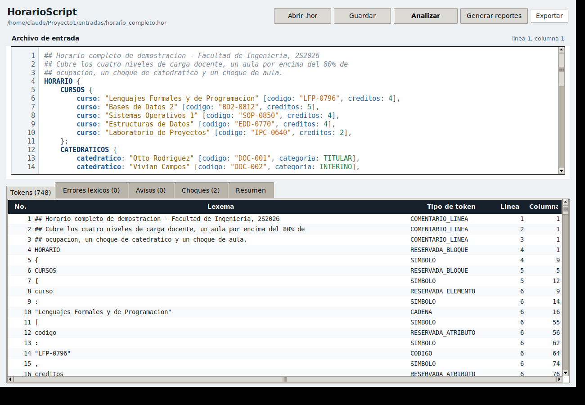
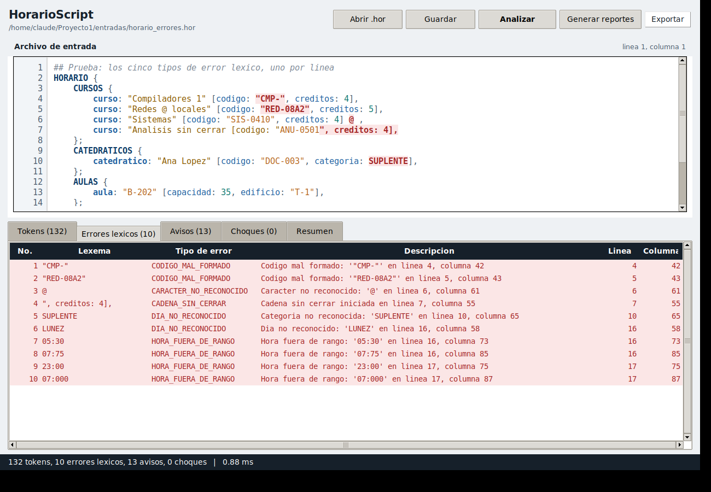
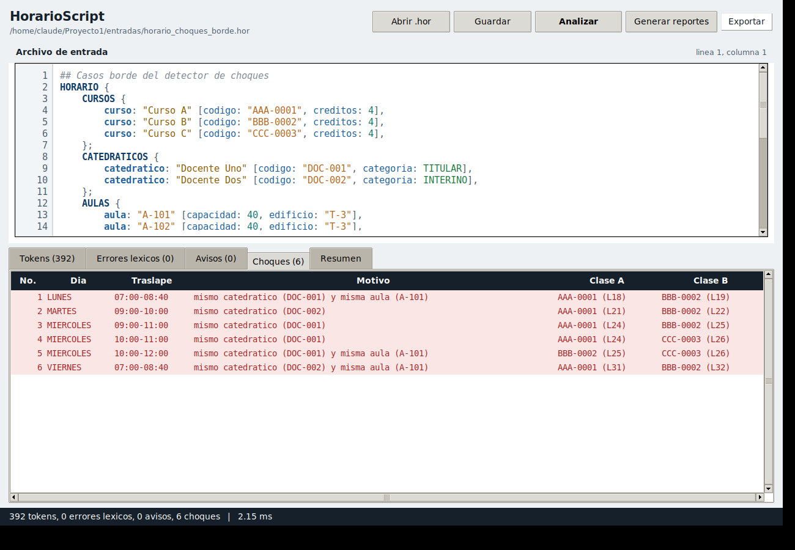
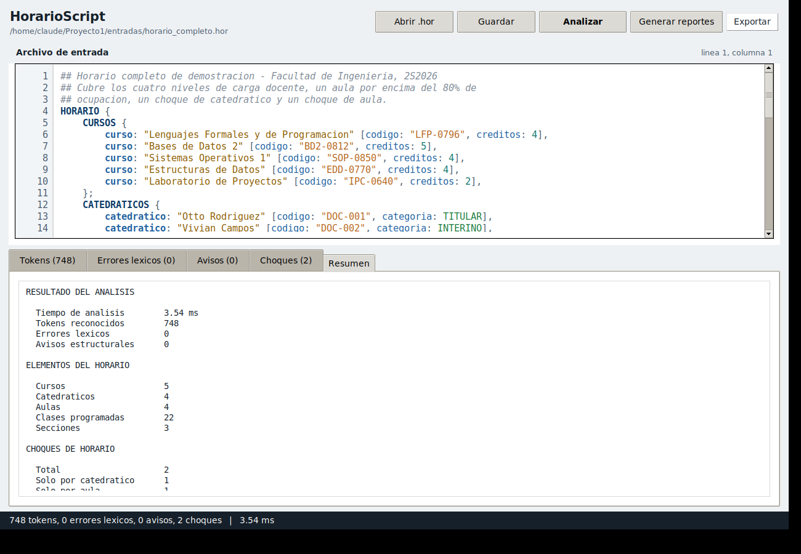
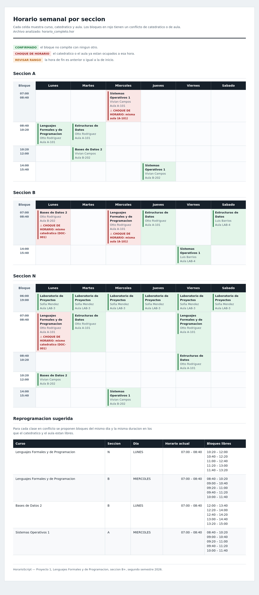
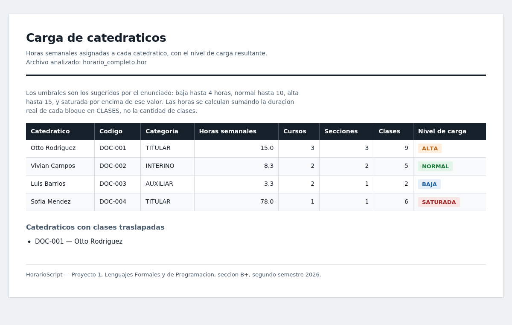
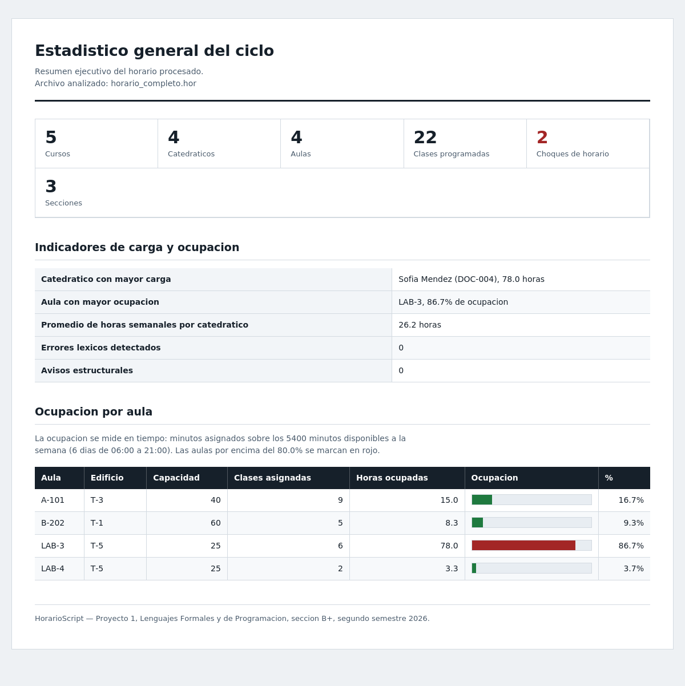
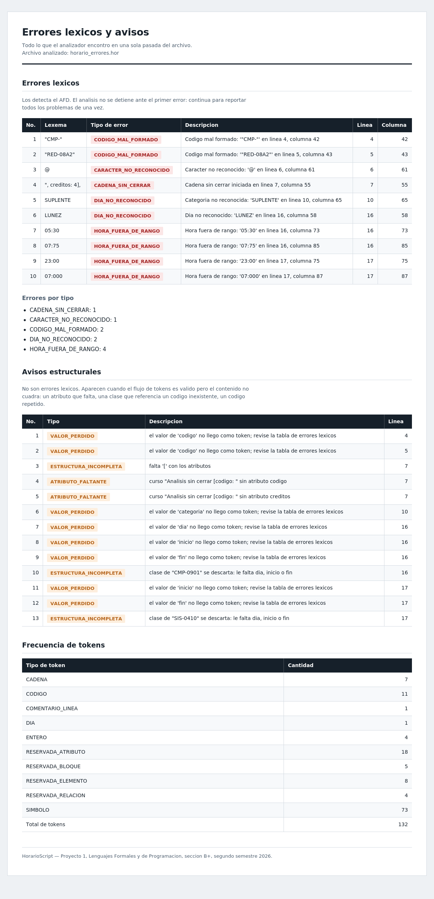

# Manual de Usuario

## HorarioScript — Analizador léxico para horarios académicos

**Proyecto 1** · Lenguajes Formales y de Programación
Facultad de Ingeniería, Universidad de San Carlos de Guatemala
Sección B+ · Segundo semestre 2026

---

## Contenido

1. [Qué hace este programa](#1-qué-hace-este-programa)
2. [Instalación y primer arranque](#2-instalación-y-primer-arranque)
3. [Cómo se escribe un archivo .hor](#3-cómo-se-escribe-un-archivo-hor)
4. [Recorrido por la ventana](#4-recorrido-por-la-ventana)
5. [Cargar y analizar un archivo](#5-cargar-y-analizar-un-archivo)
6. [Cómo leer la tabla de tokens](#6-cómo-leer-la-tabla-de-tokens)
7. [Cómo leer la tabla de errores](#7-cómo-leer-la-tabla-de-errores)
8. [Avisos y choques](#8-avisos-y-choques)
9. [Generar y navegar los reportes](#9-generar-y-navegar-los-reportes)
10. [Exportar la tabla de tokens](#10-exportar-la-tabla-de-tokens)
11. [Atajos de teclado](#11-atajos-de-teclado)
12. [Problemas frecuentes](#12-problemas-frecuentes)

---

## 1. Qué hace este programa

HorarioScript lee archivos de texto con extensión `.hor` que describen la
programación académica de una facultad: qué cursos existen, qué catedráticos
los imparten, en qué aulas y en qué horarios.

El programa hace cuatro cosas con ese archivo:

- Lo **descompone en tokens** y muestra cada pieza con su posición exacta.
- **Señala los errores de escritura** con la línea y columna donde están.
- **Detecta choques de horario**: un catedrático o un aula con dos clases al
  mismo tiempo.
- **Genera cuatro reportes** en HTML que se abren en cualquier navegador.

No hace falta saber programar para usarlo. Sí hace falta escribir el archivo
`.hor` con la estructura correcta, que se explica en la sección 3.

---

## 2. Instalación y primer arranque

### Lo que necesitás

| Requisito | Cómo conseguirlo |
|---|---|
| Python 3.10 o superior | [python.org/downloads](https://www.python.org/downloads/) |
| Tkinter | Viene incluido con Python en Windows y macOS. En Ubuntu o Debian: `sudo apt install python3-tk` |
| Graphviz | Solo si querés convertir los diagramas `.dot` en imagen. Es opcional. |

No hay que instalar librerías adicionales. No ejecutes `pip install` para
este proyecto.

### Arrancar el programa

Abrí una terminal en la carpeta del proyecto y escribí:

```bash
python main.py
```

La ventana abre vacía, lista para que cargues un archivo.

Si querés abrir un archivo directamente al arrancar:

```bash
python main.py entradas/horario_completo.hor
```

En ese caso el programa carga el archivo y lo analiza de inmediato.

> **En Windows**, si `python` no funciona, probá con `py main.py`.

---

## 3. Cómo se escribe un archivo .hor

Un archivo `.hor` tiene un bloque raíz `HORARIO` que contiene cuatro
secciones, en este orden: `CURSOS`, `CATEDRATICOS`, `AULAS` y `CLASES`.

Este es un archivo completo y válido:

```
## Horario del segundo semestre 2026
HORARIO {
    CURSOS {
        curso: "Lenguajes Formales y de Programacion" [codigo: "LFP-0796", creditos: 4],
        curso: "Bases de Datos 2" [codigo: "BD2-0812", creditos: 5],
    };
    CATEDRATICOS {
        catedratico: "Otto Rodriguez" [codigo: "DOC-001", categoria: TITULAR],
        catedratico: "Vivian Campos" [codigo: "DOC-002", categoria: INTERINO],
    };
    AULAS {
        aula: "A-101" [capacidad: 40, edificio: "T-3"],
        aula: "LAB-3" [capacidad: 25, edificio: "T-5"],
    };
    CLASES {
        clase: "LFP-0796" con "DOC-001" en "A-101" [dia: LUNES, inicio: 07:00, fin: 08:40, seccion: "N"],
        clase: "BD2-0812" con "DOC-002" en "LAB-3" [dia: MARTES, inicio: 10:20, fin: 12:00, seccion: "A"],
    };
};
```

### Las reglas que más se olvidan

**Las mayúsculas importan.** `HORARIO` es correcto; `horario` no. Los nombres
de bloque y las enumeraciones van en MAYÚSCULAS; los elementos y atributos, en
minúsculas.

| Va en mayúsculas | Va en minúsculas |
|---|---|
| `HORARIO` `CURSOS` `CATEDRATICOS` `AULAS` `CLASES` | `curso` `catedratico` `aula` `clase` |
| `LUNES` … `SABADO` | `con` `en` |
| `TITULAR` `INTERINO` `AUXILIAR` | `codigo` `creditos` `categoria` `capacidad` `edificio` `dia` `inicio` `fin` `seccion` |

**Los códigos llevan letras, guión y dígitos.** `LFP-0796`, `DOC-001`,
`A-101`, `BD2-0812`. El prefijo empieza con letra y puede llevar dígitos
después; lo que va tras el guión son solo dígitos.

| Correcto | Incorrecto | Por qué |
|---|---|---|
| `"LFP-0796"` | `"LFP-"` | falta la parte numérica |
| `"BD2-0812"` | `"101-A"` | el prefijo debe empezar con letra |
| `"A-101"` | `"RED-08A2"` | después del guión solo van dígitos |

**Las horas van de 06:00 a 21:00**, en formato de 24 horas y siempre con
cuatro dígitos. `07:00` sí; `7:00` no. `21:00` sí; `21:30` no, porque excede
el horario institucional.

**Las clases referencian códigos que ya existen.** Si escribís
`clase: "LFP-0796" con "DOC-001" en "A-101"`, esos tres códigos tienen que
estar declarados arriba en `CURSOS`, `CATEDRATICOS` y `AULAS`. Si no, el
programa te avisa.

**Los comentarios empiezan con `##`** y llegan hasta el final de la línea.
Podés poner lo que quieras adentro, incluso caracteres raros.

**Los días válidos son seis**: `LUNES`, `MARTES`, `MIERCOLES`, `JUEVES`,
`VIERNES` y `SABADO`. Sin tildes y sin domingo.

---

## 4. Recorrido por la ventana



La ventana tiene cuatro zonas:

**Arriba, la barra de herramientas.** Cinco botones: `Abrir .hor`, `Guardar`,
`Analizar`, `Generar reportes` y `Exportar`. Debajo del título aparece la ruta
del archivo abierto.

**En el medio, el editor.** Acá se ve y se edita el archivo. Tiene numeración
de línea a la izquierda y **colorea el texto según el tipo de token**: los
nombres de bloque en azul oscuro, los códigos en naranja, las horas en verde
azulado, los comentarios en gris cursiva. Los lexemas inválidos quedan con
fondo rojo. A la derecha de "Archivo de entrada" se muestra la línea y columna
donde está el cursor.

**Abajo, las cinco pestañas de resultados.** `Tokens`, `Errores léxicos`,
`Avisos`, `Choques` y `Resumen`. Cada título muestra entre paréntesis cuántos
elementos tiene, así que de un vistazo sabés si hay problemas.

**Al pie, la barra de estado.** Resume el último análisis: cuántos tokens,
errores, avisos y choques, y cuánto tardó en milisegundos.

Podés **arrastrar la división** entre el editor y las pestañas para darle más
espacio a uno o al otro.

---

## 5. Cargar y analizar un archivo

### Paso 1 — Abrir el archivo

Hacé clic en **`Abrir .hor`** o presioná `Ctrl+O`. Elegí el archivo en el
explorador. El programa lo carga en el editor y **lo analiza automáticamente**.

También podés escribir directamente en el editor sin abrir ningún archivo.

### Paso 2 — Analizar

Si editaste el texto, hacé clic en **`Analizar`** o presioná `F5`.

> **Se analiza lo que está en el editor, no el archivo guardado en disco.**
> Esto es a propósito: podés corregir un error y volver a analizar sin
> guardar. Cuando quieras conservar los cambios, usá `Guardar` o `Ctrl+S`.

### Paso 3 — Ver dónde te lleva

Después de analizar, el programa **salta solo a la pestaña más relevante**:

- Si hay errores léxicos → pestaña `Errores léxicos`
- Si no hay errores pero hay choques → pestaña `Choques`
- Si todo está limpio → pestaña `Tokens`

Si preferís empezar siempre por otra pestaña, simplemente hacé clic en ella.

---

## 6. Cómo leer la tabla de tokens

Un **token** es cada pieza mínima con significado en la que se descompone el
archivo. La palabra `HORARIO` es un token; la llave `{` es otro; el texto
`"Bases de Datos 2"` es otro.

La tabla tiene cinco columnas:

| Columna | Qué significa |
|---|---|
| **No.** | Número correlativo. El orden en que aparecen en el archivo. |
| **Lexema** | El texto exacto tal como está escrito. |
| **Tipo de token** | La categoría a la que pertenece. |
| **Línea** | En qué línea del archivo empieza. |
| **Columna** | En qué columna empieza, contando desde 1. |

### Los doce tipos de token

| Tipo | Qué es | Ejemplo |
|---|---|---|
| `RESERVADA_BLOQUE` | Nombre de sección | `HORARIO`, `CURSOS` |
| `RESERVADA_ELEMENTO` | Declara un elemento | `curso`, `aula` |
| `RESERVADA_RELACION` | Conecta una clase con su catedrático o aula | `con`, `en` |
| `RESERVADA_ATRIBUTO` | Nombre de una propiedad | `codigo`, `creditos` |
| `DIA` | Día de la semana | `MARTES` |
| `CATEGORIA` | Categoría del catedrático | `TITULAR` |
| `CODIGO` | Identificador con guión | `"LFP-0796"` |
| `CADENA` | Texto entre comillas | `"Bases de Datos 2"` |
| `HORA` | Hora en formato HH:MM | `07:00` |
| `ENTERO` | Número | `40` |
| `SIMBOLO` | Signo de puntuación | `{`, `[`, `,` |
| `COMENTARIO_LINEA` | Comentario | `## Ciclo 2026` |

### Truco útil

**Hacé doble clic en cualquier fila** y el cursor del editor salta a esa
posición, con la línea resaltada en amarillo. Funciona en las cuatro tablas,
así que es la forma más rápida de encontrar un error en un archivo largo.

---

## 7. Cómo leer la tabla de errores



Un **error léxico** es un pedazo de texto que el programa no puede reconocer
como ninguna pieza válida del lenguaje.

> **El análisis no se detiene en el primer error.** El programa sigue leyendo
> todo el archivo y te reporta todos los problemas de una sola vez. En la
> captura de arriba hay 10 errores encontrados en una única pasada.

Los lexemas con error también quedan **marcados en rojo dentro del editor**,
así que podés verlos en contexto.

### Los cinco tipos de error

| Tipo | Qué pasó | Cómo se arregla |
|---|---|---|
| `CARACTER_NO_RECONOCIDO` | Hay un carácter que no pertenece al lenguaje, como `@`, `%` o `~`. También aparece cuando una palabra no coincide con ninguna reservada. | Borrá el carácter, o revisá si escribiste mal una palabra reservada. |
| `CADENA_SIN_CERRAR` | Abriste una comilla `"` y la línea terminó sin cerrarla. | Agregá la comilla de cierre. La posición reportada es la de **apertura**. |
| `HORA_FUERA_DE_RANGO` | La hora no está entre 06:00 y 21:00, o los minutos pasan de 59. | Corregí la hora al horario institucional. |
| `DIA_NO_RECONOCIDO` | El día o la categoría no coinciden con la lista válida. | Revisá la ortografía. Sin tildes y en mayúsculas. |
| `CODIGO_MAL_FORMADO` | El código no cumple letras + guión + dígitos. | Revisá la tabla de códigos de la sección 3. |

### Un detalle que puede confundir

Cuando un error léxico se come el valor de un atributo, el programa reporta
además un aviso de tipo `VALOR_PERDIDO`. Por ejemplo, si escribís
`dia: LUNEZ`, verás dos cosas:

- en **Errores léxicos**: `DIA_NO_RECONOCIDO` sobre `LUNEZ`
- en **Avisos**: `VALOR_PERDIDO`, avisando que el atributo `dia` quedó sin
  valor

No son dos problemas distintos. Es el mismo problema visto desde las dos
capas: el analizador no reconoció la palabra, y por eso la clase quedó sin
día. Arreglando el primero desaparecen los dos.

---

## 8. Avisos y choques

### Pestaña Avisos

Un **aviso** no es un error de escritura. Aparece cuando el archivo está bien
escrito pero el contenido no cuadra.

| Aviso | Qué significa |
|---|---|
| `BLOQUE_FALTANTE` | Falta una de las cinco secciones. |
| `BLOQUE_DUPLICADO` | Una sección aparece dos veces. |
| `BLOQUE_INCORRECTO` | Declaraste un `curso` dentro de `AULAS`, por ejemplo. |
| `CODIGO_DUPLICADO` | Dos cursos, catedráticos o aulas con el mismo código. |
| `REFERENCIA_INEXISTENTE` | Una clase usa un código que no declaraste. |
| `RANGO_INVALIDO` | La clase termina antes de empezar. |
| `ATRIBUTO_FALTANTE` | Al elemento le falta una propiedad. |
| `ESTRUCTURA_INCOMPLETA` | Falta un `:`, un `[`, un `]`, o un `con` / `en`. |

Los avisos van en una pestaña aparte de los errores a propósito, para que
quede claro qué detectó el analizador léxico y qué se detectó después.

### Pestaña Choques



Un **choque de horario** ocurre cuando dos clases se pisan. Hacen falta tres
condiciones al mismo tiempo:

1. Están el mismo día.
2. Sus horarios se traslapan.
3. Comparten el catedrático **o** comparten el aula.

La tabla muestra el día, la ventana exacta del traslape, el motivo y las dos
clases involucradas con su número de línea.

### Qué **no** es un choque

Esto es importante, porque son casos que parecen conflicto y no lo son:

| Situación | ¿Es choque? |
|---|---|
| Una clase termina 08:40 y otra empieza 08:40, mismo catedrático | **No.** Es continuidad. Comparten un instante, no un intervalo. |
| Dos clases a la misma hora, en días distintos | **No.** |
| Dos clases a la misma hora, distinto catedrático y distinta aula | **No.** Eso es normal en una facultad. |
| Dos clases a la misma hora, mismo catedrático, aulas distintas | **Sí.** El catedrático no puede estar en dos lugares. |
| Dos clases traslapadas, misma aula, catedráticos distintos | **Sí.** El aula está ocupada. |

Si dos clases comparten catedrático **y** aula, se cuenta como **un solo
choque con dos motivos**, no como dos choques.

### Pestaña Resumen



Muestra todo junto: tiempo de análisis, cantidad de elementos, desglose de
choques por motivo, frecuencia de cada tipo de token, y las sugerencias de
reprogramación.

**Las sugerencias de reprogramación** son horarios alternativos para las
clases en conflicto. El programa recorre el día en pasos de 20 minutos y te
propone los bloques donde el catedrático **y** el aula están libres,
manteniendo la duración original de la clase. Si el día está completamente
ocupado, te dice que no hay bloques libres.

---

## 9. Generar y navegar los reportes

Hacé clic en **`Generar reportes`**. El programa crea una carpeta `salida/`
junto al archivo que abriste y escribe cinco archivos ahí.

Después de generar, la pestaña `Resumen` muestra cuatro botones al pie para
abrir cada reporte en tu navegador.

> Los reportes son archivos HTML independientes. Se abren en cualquier
> navegador sin conexión a internet, y los podés enviar por correo o imprimir.

### Reporte 1 — Horario semanal por sección



Una rejilla de Lunes a Sábado por cada sección del archivo. Cada celda muestra
el curso, el catedrático y el aula.

| Color de la celda | Estado | Qué significa |
|---|---|---|
| Verde | `CONFIRMADO` | El bloque no compite con ningún otro. |
| Rojo | `CHOQUE DE HORARIO` | El catedrático o el aula ya están ocupados. Se indica el motivo. |
| Naranja | `REVISAR RANGO` | La clase termina antes o al mismo tiempo que empieza. |

Al final del reporte está la tabla de **reprogramación sugerida**, con los
bloques libres para cada clase en conflicto.

Las filas de la rejilla corresponden a los bloques que realmente existen en tu
archivo, no a una lista fija de todas las horas del día. Por eso la tabla es
compacta.

### Reporte 2 — Carga de catedráticos



Cuántas horas semanales tiene asignado cada catedrático, cuántos cursos y
secciones atiende, y su nivel de carga.

| Nivel | Horas semanales | Color |
|---|---|---|
| BAJA | 1 a 4 | azul |
| NORMAL | 5 a 10 | verde |
| ALTA | 11 a 15 | naranja |
| SATURADA | 16 o más | rojo |

Las horas se calculan sumando la duración real de cada bloque, no contando
clases: dos clases de 100 minutos pesan más que tres de 50.

Al pie se listan los catedráticos que tienen clases traslapadas.

### Reporte 3 — Estadístico general del ciclo



Arriba, un panel con los números clave: cursos, catedráticos, aulas, clases,
choques y secciones. Si hay choques, ese número aparece en rojo.

En el medio, los indicadores: quién tiene más carga, qué aula está más
ocupada, el promedio de horas por catedrático, y los errores y avisos
encontrados.

Abajo, la tabla de **ocupación por aula** con barra de progreso. Las aulas por
encima del 80% se marcan en rojo.

> **Sobre los porcentajes bajos.** La ocupación se mide contra las 90 horas
> disponibles a la semana (6 días de 06:00 a 21:00). Un aula con tres clases
> de 100 minutos da 5.6%. No es un error de cálculo: es que un aula ocupada
> tres veces por semana está, efectivamente, casi libre.

### Reporte 4 — Errores léxicos y avisos



La misma información de las pestañas `Errores léxicos` y `Avisos`, en formato
imprimible, más la frecuencia de tokens por tipo. Sirve para entregarle el
detalle a alguien que no tiene el programa instalado.

### El diagrama de jerarquía

El quinto archivo, `jerarquia_horario.dot`, es el código de un grafo que
muestra la jerarquía del horario y las relaciones curso-catedrático-aula. Las
clases en conflicto aparecen en rojo con líneas punteadas.

Para convertirlo en imagen necesitás Graphviz instalado:

```bash
dot -Tpng salida/jerarquia_horario.dot -o salida/jerarquia_horario.png
```

Si no tenés Graphviz, podés pegar el contenido del archivo en
[dreampuf.github.io/GraphvizOnline](https://dreampuf.github.io/GraphvizOnline/)
y verlo en el navegador.

---

## 10. Exportar la tabla de tokens

El botón **`Exportar`** abre un menú con dos opciones:

- **Tabla de tokens a CSV** — para abrirla en Excel o Google Sheets
- **Tabla de tokens a JSON** — para procesarla con otro programa

Ambos formatos incluyen el número, el lexema, el tipo, la línea y la columna
de cada token. Hay que analizar el archivo antes de exportar; si no, el
programa te avisa que no hay nada que exportar.

---

## 11. Atajos de teclado

| Atajo | Acción |
|---|---|
| `Ctrl + O` | Abrir un archivo `.hor` |
| `Ctrl + S` | Guardar los cambios del editor |
| `Ctrl + R` o `F5` | Analizar |
| `Ctrl + Z` | Deshacer en el editor |
| Doble clic en una fila | Ir a esa posición en el editor |

---

## 12. Problemas frecuentes

### El programa no arranca y dice que falta Tkinter

Tkinter viene con Python en Windows y macOS. Si lo reinstalás en Windows,
marcá la opción **"tcl/tk and IDLE"** durante la instalación.

En Ubuntu o Debian:

```bash
sudo apt install python3-tk
```

### Escribí el archivo y todo sale como error

Revisá las mayúsculas. `horario` en minúsculas no es lo mismo que `HORARIO`.
Es la causa más común.

### Un solo error me generó muchos avisos

Es normal. Un error léxico en medio de una lista de atributos deja esa clase o
ese elemento incompleto, y el programa te avisa de cada pieza que faltó.
Arreglá primero los errores léxicos y volvé a analizar: la mayoría de los
avisos desaparece sola.

### Una cadena sin cerrar me desordenó el resto del archivo

Cuando falta una comilla de cierre, el programa lee todo lo que sigue como si
fuera parte del texto, hasta encontrar la siguiente comilla. Eso suele
producir varios errores en cascada. Buscá el **primer** error de tipo
`CADENA_SIN_CERRAR`, arreglalo y volvé a analizar.

### El botón Generar reportes no hace nada

Tenés que analizar primero. Si el editor está vacío o nunca presionaste
`Analizar`, el programa te lo indica con un mensaje.

### No encuentro los reportes generados

Están en una carpeta `salida/` junto al archivo `.hor` que abriste. Si
escribiste el contenido directamente en el editor sin abrir ningún archivo, la
carpeta se crea donde estabas cuando ejecutaste `python main.py`.

### Los colores del editor no se actualizan al escribir

El coloreado se reaplica unos instantes después de que dejás de teclear, no en
cada letra. Es a propósito: reanalizar en cada pulsación haría que la ventana
se sintiera trabada en archivos grandes.

### Los reportes se ven mal al imprimir

Los reportes tienen estilos específicos para impresión. Si tu navegador no
imprime los colores de fondo, buscá en el diálogo de impresión la opción
**"Gráficos de fondo"** o **"Background graphics"** y activala.
